## IPA 주관 인공지능센터 기본(fundamental) 과정
- GitHub link: [here](https://github.com/Wind-Kyle/ai-course-fundamentals)
- E-Mail: windkyle7@gmail.com

# Python Plots 

## Matplotlib
- Pylab interface + matplotlib API(multi backends)
- rich ecosystem of python tools built around it 
- De Facto of Python
- The base of many libraries

### Matplotlib의 구성요소
<table>
    <tr>
        <th>이름</th>
        <th>특징</th>
    </tr>
    <tr>
        <td>Canvas</td>
        <td>
            <ol>
                <li>Graphic을 그려주는 객체</li>
                <li>Don’t worry too much about the canvas, it is crucial as it is the object that actually does the drawing to get you your plot, but as the user it is more-or-less invisible to you</li>
                <li>Figure 뿐만 아니라 Image, Text도 모두 Canvas에서 화면에 뿌려줌</li>
            </ol>
        </td>
    </tr>
    <tr>
        <td>Figure</td>
        <td>
            <ol>
                <li>Axes을 자식으로 갖는 객체</li>
                <li>Axes를 0개부터 여러 개까지 가질 수 있음(subplot)</li>
                <li>Rendering 되어야 함</li>
            </ol>
        </td>
    </tr>
    <tr>
        <td>Axes</td>
        <td>
            <ol>
                <li>일반적으로 Plot이라고 생각되는 객체</li>
                <li>The region of the image with the data space</li>
                <li>Figure는 여러 개의 Axes를 가질 수 있으나, 하나의 Axes는 하나의 Figure 위에만 있
을 수 있음
</li>
                <li>Axes는 2~3개의 Axis를 가짐(Axes와 Axis는 다른 것이므로 유의)</li>
            </ol>
        </td>
    </tr>
    <tr>
        <td>Axis</td>
        <td>
            <ol>
                <li>Graph limit(x_lim, y_lim)을 정하고 Tick/ticklabel(ticks에 붙는 label string)을 정하는 역할을 함</li>
                <li>Locator 객체가 tick의 위치를 정하고 Formatter가 tick label string을 formatted함</li>
            </ol>
        </td>
    </tr>
    <tr>
        <td>Artist</td>
        <td>
            <ol>
                <li>Figure 위에 보이는 것들은 모두 Artist 객체</li>
                <li>Figure, Axes, Axis 객체 역시 Artist 객체</li>
                <li>Text, Line2D, collection, patch 등도 모두 artist 객체</li>
            </ol>
        </td>
    </tr>
    
</table>


```python
import matplotlib
import matplotlib.pyplot as plt
%matplotlib inline
```


```python
matplotlib.__version__
```


    '3.0.3'


### Figure
- 그래프를 구성하는 기본 객체 (틀)
- Figure를 별도로 선언하지 않을 경우, axes 등 하위 객체 생성시 자동적으로 생성


```python
plt.figure()
plt.show()
```


    <Figure size 432x288 with 0 Axes>


### Axes
- plot에 대한 정보를 관리하는 영역


```python
plt.figure()
plt.axes()
plt.show()
```


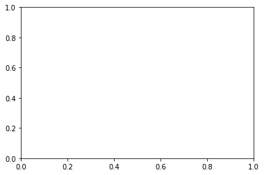


```python
plt.figure()
plt.axes([0, 0, 1, 1], frameon=False)
plt.axes([0.3, 0.3, 0.5, 0.5])
plt.show()
```


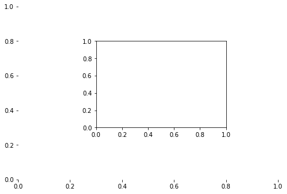


### Axis
- 각 데이터 축을 관리


```python
plt.figure()
plt.axes()
plt.axis([0, 100, 0, 100])
plt.show()
```


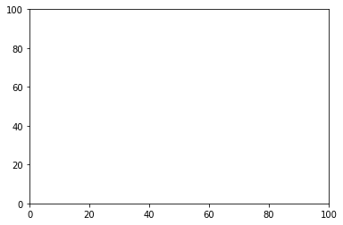


### Axis
- Xlim: x축의 최대값 및 최솟값 관리
- Ylim: y축의 최대값 및 최솟값 관리


```python
plt.figure()
plt.axes()
plt.axis((0, 10, 0, 100))
plt.axes((0.3, 0.2, 0.4, 0.4))
xmin, xmax = plt.xlim(10, 20)
ymin, ymax = plt.ylim(30, 70)
plt.show()
print('xmin, xmax:', xmin, xmax)
print('ymin, ymax:', ymin, ymax)
```


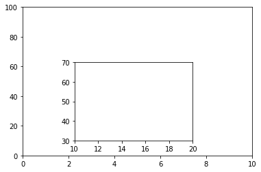


    xmin, xmax: 10 20
    ymin, ymax: 30 70


### Ticks
- 각 축의 간격 및 값을 지정


```python
import numpy as np
```


```python
plt.figure()
plt.axes()
plt.xticks(np.arange(0, 10, step=1))
plt.yticks(np.arange(-1, 6),
              ('', 'Worst', 'Bad', 'Normal',
                   'Good', 'Best', ''))
plt.show()
```


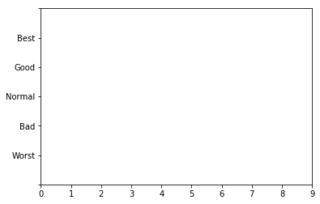


### Grid
- plot에 격자를 출력


```python
plt.figure()
plt.axes()
plt.grid()
plt.show()
```


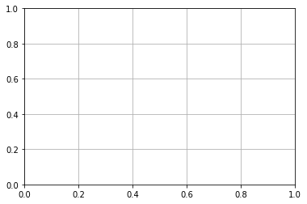


```python
plt.figure()
plt.axes()
plt.xticks(np.arange(0, 10, step=1))
plt.grid(True, 'major', 'x', color='b',
            linestyle='--', linewidth=2)
plt.ylim(0.5)
plt.grid(True, 'major', 'y', color='r', linewidth=3)
plt.show()
```


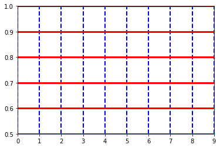


### Labels
- Axes의 각 축을 설명하는 문자열


```python
plt.figure()
plt.axes()
plt.xlabel('X Label')
plt.ylabel('Y Label')
plt.show()
```


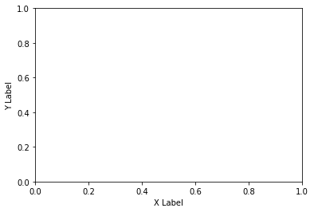


```python
plt.figure()
plt.axes()
plt.xlabel('X Label', labelpad=50, color='g', fontsize=20)
font = {}
font['family'] = 'serif'
font['color'] = 'darkred'
font['weight'] = 'normal'
font['size'] = 16
plt.ylabel('Y Label', fontdict=font, labelpad=20)
plt.show()
```


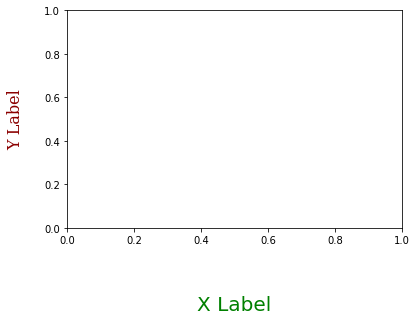


### Title
- Axes의 plot을 설명하는 제목 문구


```python
plt.figure()
plt.axes()
plt.title('Title')
plt.show()
```


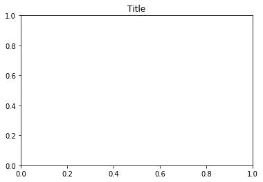


```python
plt.figure()
plt.axes()
font = {}
font['family'] = 'serif'
font['color'] = 'blue'
font['size'] = 16
plt.title('Title', font)
plt.show()
```


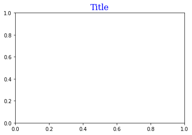


### Legends
- plot 데이터의 범례


```python
plt.figure()
plt.plot([1, 2, 3, 4, 5],
         [10, 40, 20, 30, 50],
        label='label1')
plt.plot([1, 2, 3, 4, 5],
         [50, 10, 30, 20, 0],
        label='label2')
plt.legend()
plt.show()
```


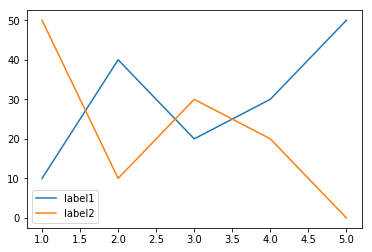


## Basic Graph

### 시각화의 8가지 유형
- Stephen Few의 8가지 정량적 표현 유형

|  종류  |  설명  |  예시  |
| ------ | ----- | ----- |
|시계열 표현| 일정 기간 동안의 단일 변수를 표현 |Line Chart|
|순위 표현| 범주 세분이 같은 데이터의 순위를, 오름차순 또는 내림차순으로 표현 |Bar Chart, Bar Graph|
|부분과 전체| 전체에 대한 범주형 세분 비율 표현 |Pie Chart|
|편차 |표준으로부터 벗어난 차이의 표현 |Distribution Chart|
|빈도분포| 주어진 변수의 발생 빈도를 표현| Histogram, Box Plot, Violin Plot|
|상관관계| 두 변수의 연관성 값을 비교하여 표현 |Scatter Plot|
|Nominal 비교| 특정 순서없이 카테고리 하위 구분을 비교 |Bar chart|
|지리정보| 지리적인 데이터의 시각적 표현| Cartogram|

### Line plot
- 가장 기본적인 그래프
- 2개의 변수를 비교할 때 효과적
- 시계열 데이터의 변화를 확인
- 정규분포 확인 가능


```python
x = [0, 1, 2, 3, 4, 5]
y = [0, 1, 2, 3, 4, 5]
plt.plot(x, y)
```


    [<matplotlib.lines.Line2D at 0x7f698e75d9e8>]


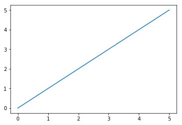


### Bar plot
- 여러 종류의 분류형 데이터를 비교
- X축은 범주, Y축은 값을 주로 사용


```python
x = ['사탕', '초콜릿', '빵', '과자', '쿠키']
y = [10, 12, 8, 9, 5]
plt.bar(x, y)
```


    <BarContainer object of 5 artists>


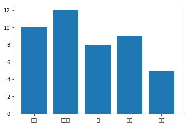


### Scatter plot
- 2개의 변수에서 데이터의 분포를 확인
- 주로 상관관계를 분석함


```python
x = [3, 2, 2, 3, 5, 5, 1, 3, 4, 5]
y = [3, 1, 2, 3, 4, 5, 2, 2, 4, 5]
plt.scatter(x, y)
```


    <matplotlib.collections.PathCollection at 0x7f698e93c5f8>


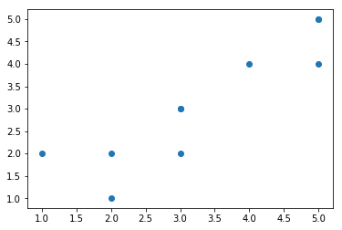


### Multi Line plot
- Line 그래프를 여러 개를 그림
- 각 변수들의 분포를 확인 가능
- 시계열 또는 범주형 데이터 확인


```python
import pandas as pd
```


```python
iris = pd.read_csv('http://archive.ics.uci.edu/ml/machine-learning-databases/iris/iris.data', header=None)
iris.columns = ['Sepal Length', 'Sepal Width', 'Petal Length', 'Petal Width', 'Class']

plt.figure()
plt.plot(iris['Sepal Length'].values, label='Sepal Length')
plt.plot(iris['Sepal Width'].values, label='Sepal Width')
plt.plot(iris['Petal Length'].values, label='Petal Length')
plt.plot(iris['Petal Width'].values, label='Petal Width')
plt.legend()
plt.show()
```


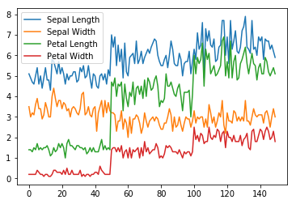


### Box plot
- 상자와 수염으로 이루어짐
- 최솟값, 최댓값, 1 2 3사분위 표현
- 비슷한 크기의 값들을 함께 나타냄


```python
iris = pd.read_csv('http://archive.ics.uci.edu/ml/machine-learning-databases/iris/iris.data', header=None)
iris.columns = ['Sepal Length', 'Sepal Width', 'Petal Length', 'Petal Width', 'Class']
collection = iris[['Sepal Length', 'Sepal Width', 'Petal Length', 'Petal Width']].values

plt.figure()
plt.boxplot(collection)
plt.xticks([1, 2, 3, 4], ('Sepal Length', 'Sepal Width', 'Petal Length', 'Petal Width'))
plt.show()
```


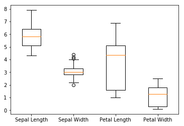


```python
iris.plot.box()
```


    <matplotlib.axes._subplots.AxesSubplot at 0x7f6987b646a0>


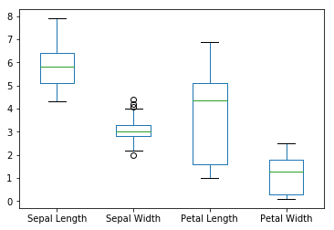


```python
iris.plot(kind='box')
```


    <matplotlib.axes._subplots.AxesSubplot at 0x7f698716a9b0>


### Violin Plot
- Box plot과 유사함
- 분포를 두께로 표현


```python
iris = pd.read_csv('http://archive.ics.uci.edu/ml/machine-learning-databases/iris/iris.data', header=None)
iris.columns = ['Sepal Length', 'Sepal Width', 'Petal Length', 'Petal Width', 'Class']
collection = iris[['Sepal Length', 'Sepal Width', 'Petal Length', 'Petal Width']].values

plt.figure()
plt.violinplot(collection)
plt.xticks([1, 2, 3, 4], ('Sepal Length', 'Sepal Width', 'Petal Length', 'Petal Width'))
plt.show()
```


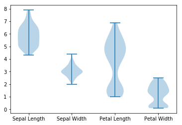

