```python
import geopandas as gpd
```


```python
%matplotlib inline
```


```python
world = gpd.read_file(gpd.datasets.get_path('naturalearth_lowres'))
```


```python
gpd.datasets.available
```


    ['naturalearth_cities', 'naturalearth_lowres', 'nybb']


```python
world_cities = gpd.read_file(gpd.datasets.get_path('naturalearth_cities'))
```


```python
world.head()
```


<div>
<style scoped>
    .dataframe tbody tr th:only-of-type {
        vertical-align: middle;
    }

    .dataframe tbody tr th {
        vertical-align: top;
    }

    .dataframe thead th {
        text-align: right;
    }
</style>
<table border="1" class="dataframe">
  <thead>
    <tr style="text-align: right;">
      <th></th>
      <th>pop_est</th>
      <th>continent</th>
      <th>name</th>
      <th>iso_a3</th>
      <th>gdp_md_est</th>
      <th>geometry</th>
    </tr>
  </thead>
  <tbody>
    <tr>
      <th>0</th>
      <td>920938</td>
      <td>Oceania</td>
      <td>Fiji</td>
      <td>FJI</td>
      <td>8374.0</td>
      <td>(POLYGON ((180 -16.06713266364245, 180 -16.555...</td>
    </tr>
    <tr>
      <th>1</th>
      <td>53950935</td>
      <td>Africa</td>
      <td>Tanzania</td>
      <td>TZA</td>
      <td>150600.0</td>
      <td>POLYGON ((33.90371119710453 -0.950000000000000...</td>
    </tr>
    <tr>
      <th>2</th>
      <td>603253</td>
      <td>Africa</td>
      <td>W. Sahara</td>
      <td>ESH</td>
      <td>906.5</td>
      <td>POLYGON ((-8.665589565454809 27.65642588959236...</td>
    </tr>
    <tr>
      <th>3</th>
      <td>35623680</td>
      <td>North America</td>
      <td>Canada</td>
      <td>CAN</td>
      <td>1674000.0</td>
      <td>(POLYGON ((-122.84 49.00000000000011, -122.974...</td>
    </tr>
    <tr>
      <th>4</th>
      <td>326625791</td>
      <td>North America</td>
      <td>United States of America</td>
      <td>USA</td>
      <td>18560000.0</td>
      <td>(POLYGON ((-122.84 49.00000000000011, -120 49....</td>
    </tr>
  </tbody>
</table>
</div>


```python
world_cities.plot()
```


    <matplotlib.axes._subplots.AxesSubplot at 0x7fba8f7c6f60>


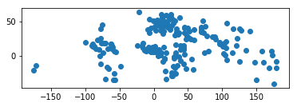


```python
world.plot()
```


    <matplotlib.axes._subplots.AxesSubplot at 0x7fba89e9a1d0>


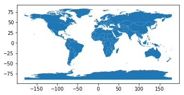


```python
world['centroid_column'] = world.centroid 
world = world.set_geometry('centroid_column') 
world.plot()
```


    <matplotlib.axes._subplots.AxesSubplot at 0x7fba89e14be0>


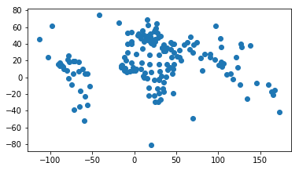


```python
world.geometry.name
```


    'centroid_column'


```python
import fiona
```


```python
fiona.supported_drivers
```


    {'AeronavFAA': 'r',
     'ARCGEN': 'r',
     'BNA': 'raw',
     'DXF': 'raw',
     'CSV': 'raw',
     'OpenFileGDB': 'r',
     'ESRIJSON': 'r',
     'ESRI Shapefile': 'raw',
     'GeoJSON': 'rw',
     'GPKG': 'rw',
     'GML': 'raw',
     'GPX': 'raw',
     'GPSTrackMaker': 'raw',
     'Idrisi': 'r',
     'MapInfo File': 'raw',
     'DGN': 'raw',
     'S57': 'r',
     'SEGY': 'r',
     'SUA': 'r',
     'TopoJSON': 'r'}


```python
world = gpd.read_file(gpd.datasets.get_path('naturalearth_lowres')) 
southern_world = world.cx[:, :0]
southern_world.plot(figsize=(10, 3))
```


    <matplotlib.axes._subplots.AxesSubplot at 0x7fba89e70390>


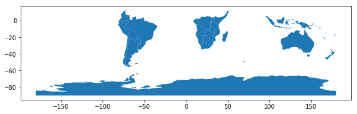


```python
world
```


<div>
<style scoped>
    .dataframe tbody tr th:only-of-type {
        vertical-align: middle;
    }

    .dataframe tbody tr th {
        vertical-align: top;
    }

    .dataframe thead th {
        text-align: right;
    }
</style>
<table border="1" class="dataframe">
  <thead>
    <tr style="text-align: right;">
      <th></th>
      <th>pop_est</th>
      <th>continent</th>
      <th>name</th>
      <th>iso_a3</th>
      <th>gdp_md_est</th>
      <th>geometry</th>
    </tr>
  </thead>
  <tbody>
    <tr>
      <th>0</th>
      <td>920938</td>
      <td>Oceania</td>
      <td>Fiji</td>
      <td>FJI</td>
      <td>8374.0</td>
      <td>(POLYGON ((180 -16.06713266364245, 180 -16.555...</td>
    </tr>
    <tr>
      <th>1</th>
      <td>53950935</td>
      <td>Africa</td>
      <td>Tanzania</td>
      <td>TZA</td>
      <td>150600.0</td>
      <td>POLYGON ((33.90371119710453 -0.950000000000000...</td>
    </tr>
    <tr>
      <th>2</th>
      <td>603253</td>
      <td>Africa</td>
      <td>W. Sahara</td>
      <td>ESH</td>
      <td>906.5</td>
      <td>POLYGON ((-8.665589565454809 27.65642588959236...</td>
    </tr>
    <tr>
      <th>3</th>
      <td>35623680</td>
      <td>North America</td>
      <td>Canada</td>
      <td>CAN</td>
      <td>1674000.0</td>
      <td>(POLYGON ((-122.84 49.00000000000011, -122.974...</td>
    </tr>
    <tr>
      <th>4</th>
      <td>326625791</td>
      <td>North America</td>
      <td>United States of America</td>
      <td>USA</td>
      <td>18560000.0</td>
      <td>(POLYGON ((-122.84 49.00000000000011, -120 49....</td>
    </tr>
    <tr>
      <th>5</th>
      <td>18556698</td>
      <td>Asia</td>
      <td>Kazakhstan</td>
      <td>KAZ</td>
      <td>460700.0</td>
      <td>POLYGON ((87.35997033076265 49.21498078062912,...</td>
    </tr>
    <tr>
      <th>6</th>
      <td>29748859</td>
      <td>Asia</td>
      <td>Uzbekistan</td>
      <td>UZB</td>
      <td>202300.0</td>
      <td>POLYGON ((55.96819135928291 41.30864166926936,...</td>
    </tr>
    <tr>
      <th>7</th>
      <td>6909701</td>
      <td>Oceania</td>
      <td>Papua New Guinea</td>
      <td>PNG</td>
      <td>28020.0</td>
      <td>(POLYGON ((141.0002104025918 -2.60015105551566...</td>
    </tr>
    <tr>
      <th>8</th>
      <td>260580739</td>
      <td>Asia</td>
      <td>Indonesia</td>
      <td>IDN</td>
      <td>3028000.0</td>
      <td>(POLYGON ((141.0002104025918 -2.60015105551566...</td>
    </tr>
    <tr>
      <th>9</th>
      <td>44293293</td>
      <td>South America</td>
      <td>Argentina</td>
      <td>ARG</td>
      <td>879400.0</td>
      <td>(POLYGON ((-68.63401022758323 -52.636370458874...</td>
    </tr>
    <tr>
      <th>10</th>
      <td>17789267</td>
      <td>South America</td>
      <td>Chile</td>
      <td>CHL</td>
      <td>436100.0</td>
      <td>(POLYGON ((-68.63401022758323 -52.636370458874...</td>
    </tr>
    <tr>
      <th>11</th>
      <td>83301151</td>
      <td>Africa</td>
      <td>Dem. Rep. Congo</td>
      <td>COD</td>
      <td>66010.0</td>
      <td>POLYGON ((29.33999759290035 -4.499983412294092...</td>
    </tr>
    <tr>
      <th>12</th>
      <td>7531386</td>
      <td>Africa</td>
      <td>Somalia</td>
      <td>SOM</td>
      <td>4719.0</td>
      <td>POLYGON ((41.58513 -1.68325, 40.993 -0.85829, ...</td>
    </tr>
    <tr>
      <th>13</th>
      <td>47615739</td>
      <td>Africa</td>
      <td>Kenya</td>
      <td>KEN</td>
      <td>152700.0</td>
      <td>POLYGON ((39.20222 -4.67677, 37.7669 -3.67712,...</td>
    </tr>
    <tr>
      <th>14</th>
      <td>37345935</td>
      <td>Africa</td>
      <td>Sudan</td>
      <td>SDN</td>
      <td>176300.0</td>
      <td>POLYGON ((24.56736901215208 8.229187933785468,...</td>
    </tr>
    <tr>
      <th>15</th>
      <td>12075985</td>
      <td>Africa</td>
      <td>Chad</td>
      <td>TCD</td>
      <td>30590.0</td>
      <td>POLYGON ((23.83766000000014 19.5804700000001, ...</td>
    </tr>
    <tr>
      <th>16</th>
      <td>10646714</td>
      <td>North America</td>
      <td>Haiti</td>
      <td>HTI</td>
      <td>19340.0</td>
      <td>POLYGON ((-71.71236141629296 19.71445587816736...</td>
    </tr>
    <tr>
      <th>17</th>
      <td>10734247</td>
      <td>North America</td>
      <td>Dominican Rep.</td>
      <td>DOM</td>
      <td>161900.0</td>
      <td>POLYGON ((-71.70830481635805 18.04499705654609...</td>
    </tr>
    <tr>
      <th>18</th>
      <td>142257519</td>
      <td>Europe</td>
      <td>Russia</td>
      <td>RUS</td>
      <td>3745000.0</td>
      <td>(POLYGON ((178.7253 71.0988, 180.0000000000001...</td>
    </tr>
    <tr>
      <th>19</th>
      <td>329988</td>
      <td>North America</td>
      <td>Bahamas</td>
      <td>BHS</td>
      <td>9066.0</td>
      <td>(POLYGON ((-78.98 26.79, -78.51000000000001 26...</td>
    </tr>
    <tr>
      <th>20</th>
      <td>2931</td>
      <td>South America</td>
      <td>Falkland Is.</td>
      <td>FLK</td>
      <td>281.8</td>
      <td>POLYGON ((-61.2 -51.85, -60 -51.25, -59.15 -51...</td>
    </tr>
    <tr>
      <th>21</th>
      <td>5320045</td>
      <td>Europe</td>
      <td>Norway</td>
      <td>-99</td>
      <td>364700.0</td>
      <td>(POLYGON ((15.14282 79.67431000000001, 15.5225...</td>
    </tr>
    <tr>
      <th>22</th>
      <td>57713</td>
      <td>North America</td>
      <td>Greenland</td>
      <td>GRL</td>
      <td>2173.0</td>
      <td>POLYGON ((-46.76379 82.62796, -43.40644 83.225...</td>
    </tr>
    <tr>
      <th>23</th>
      <td>140</td>
      <td>Seven seas (open ocean)</td>
      <td>Fr. S. Antarctic Lands</td>
      <td>ATF</td>
      <td>16.0</td>
      <td>POLYGON ((68.935 -48.62500000000001, 69.58 -48...</td>
    </tr>
    <tr>
      <th>24</th>
      <td>1291358</td>
      <td>Asia</td>
      <td>Timor-Leste</td>
      <td>TLS</td>
      <td>4975.0</td>
      <td>POLYGON ((124.9686824891162 -8.892790215697083...</td>
    </tr>
    <tr>
      <th>25</th>
      <td>54841552</td>
      <td>Africa</td>
      <td>South Africa</td>
      <td>ZAF</td>
      <td>739100.0</td>
      <td>POLYGON ((16.34497684089524 -28.5767050106977,...</td>
    </tr>
    <tr>
      <th>26</th>
      <td>1958042</td>
      <td>Africa</td>
      <td>Lesotho</td>
      <td>LSO</td>
      <td>6019.0</td>
      <td>POLYGON ((28.97826256685724 -28.95559661226171...</td>
    </tr>
    <tr>
      <th>27</th>
      <td>124574795</td>
      <td>North America</td>
      <td>Mexico</td>
      <td>MEX</td>
      <td>2307000.0</td>
      <td>POLYGON ((-117.1277599999999 32.53533999999996...</td>
    </tr>
    <tr>
      <th>28</th>
      <td>3360148</td>
      <td>South America</td>
      <td>Uruguay</td>
      <td>URY</td>
      <td>73250.0</td>
      <td>POLYGON ((-57.62513342958296 -30.2162948544542...</td>
    </tr>
    <tr>
      <th>29</th>
      <td>207353391</td>
      <td>South America</td>
      <td>Brazil</td>
      <td>BRA</td>
      <td>3081000.0</td>
      <td>POLYGON ((-53.37366166849824 -33.7683777809007...</td>
    </tr>
    <tr>
      <th>...</th>
      <td>...</td>
      <td>...</td>
      <td>...</td>
      <td>...</td>
      <td>...</td>
      <td>...</td>
    </tr>
    <tr>
      <th>147</th>
      <td>104256076</td>
      <td>Asia</td>
      <td>Philippines</td>
      <td>PHL</td>
      <td>801900.0</td>
      <td>(POLYGON ((120.8338961121466 12.70449616134243...</td>
    </tr>
    <tr>
      <th>148</th>
      <td>31381992</td>
      <td>Asia</td>
      <td>Malaysia</td>
      <td>MYS</td>
      <td>863000.0</td>
      <td>(POLYGON ((100.0857568705271 6.464489447450291...</td>
    </tr>
    <tr>
      <th>149</th>
      <td>443593</td>
      <td>Asia</td>
      <td>Brunei</td>
      <td>BRN</td>
      <td>33730.0</td>
      <td>POLYGON ((115.4507104838698 5.447729803891534,...</td>
    </tr>
    <tr>
      <th>150</th>
      <td>1972126</td>
      <td>Europe</td>
      <td>Slovenia</td>
      <td>SVN</td>
      <td>68350.0</td>
      <td>POLYGON ((13.80647545742153 46.50930613869122,...</td>
    </tr>
    <tr>
      <th>151</th>
      <td>5491218</td>
      <td>Europe</td>
      <td>Finland</td>
      <td>FIN</td>
      <td>224137.0</td>
      <td>POLYGON ((28.59192955904319 69.06477692328666,...</td>
    </tr>
    <tr>
      <th>152</th>
      <td>5445829</td>
      <td>Europe</td>
      <td>Slovakia</td>
      <td>SVK</td>
      <td>168800.0</td>
      <td>POLYGON ((22.55813764821175 49.08573802346714,...</td>
    </tr>
    <tr>
      <th>153</th>
      <td>10674723</td>
      <td>Europe</td>
      <td>Czechia</td>
      <td>CZE</td>
      <td>350900.0</td>
      <td>POLYGON ((15.01699588385867 51.10667409932158,...</td>
    </tr>
    <tr>
      <th>154</th>
      <td>5918919</td>
      <td>Africa</td>
      <td>Eritrea</td>
      <td>ERI</td>
      <td>9169.0</td>
      <td>POLYGON ((36.42951000000005 14.42211000000003,...</td>
    </tr>
    <tr>
      <th>155</th>
      <td>126451398</td>
      <td>Asia</td>
      <td>Japan</td>
      <td>JPN</td>
      <td>4932000.0</td>
      <td>(POLYGON ((141.884600864835 39.18086456965148,...</td>
    </tr>
    <tr>
      <th>156</th>
      <td>6943739</td>
      <td>South America</td>
      <td>Paraguay</td>
      <td>PRY</td>
      <td>64670.0</td>
      <td>POLYGON ((-58.16639238140804 -20.1767009416536...</td>
    </tr>
    <tr>
      <th>157</th>
      <td>28036829</td>
      <td>Asia</td>
      <td>Yemen</td>
      <td>YEM</td>
      <td>73450.0</td>
      <td>POLYGON ((52.00000980002224 19.00000336351606,...</td>
    </tr>
    <tr>
      <th>158</th>
      <td>28571770</td>
      <td>Asia</td>
      <td>Saudi Arabia</td>
      <td>SAU</td>
      <td>1731000.0</td>
      <td>POLYGON ((34.95603722508426 29.35655467377885,...</td>
    </tr>
    <tr>
      <th>159</th>
      <td>4050</td>
      <td>Antarctica</td>
      <td>Antarctica</td>
      <td>ATA</td>
      <td>810.0</td>
      <td>(POLYGON ((-48.66061601418252 -78.047018731598...</td>
    </tr>
    <tr>
      <th>160</th>
      <td>265100</td>
      <td>Asia</td>
      <td>N. Cyprus</td>
      <td>-99</td>
      <td>3600.0</td>
      <td>POLYGON ((32.73178022637745 35.14002594658844,...</td>
    </tr>
    <tr>
      <th>161</th>
      <td>1221549</td>
      <td>Asia</td>
      <td>Cyprus</td>
      <td>CYP</td>
      <td>29260.0</td>
      <td>POLYGON ((32.73178022637745 35.14002594658844,...</td>
    </tr>
    <tr>
      <th>162</th>
      <td>33986655</td>
      <td>Africa</td>
      <td>Morocco</td>
      <td>MAR</td>
      <td>282800.0</td>
      <td>POLYGON ((-2.169913702798624 35.16839630791668...</td>
    </tr>
    <tr>
      <th>163</th>
      <td>97041072</td>
      <td>Africa</td>
      <td>Egypt</td>
      <td>EGY</td>
      <td>1105000.0</td>
      <td>POLYGON ((36.86622999999997 22, 32.89999999999...</td>
    </tr>
    <tr>
      <th>164</th>
      <td>6653210</td>
      <td>Africa</td>
      <td>Libya</td>
      <td>LBY</td>
      <td>90890.0</td>
      <td>POLYGON ((25 22, 25.00000000000011 20.00304000...</td>
    </tr>
    <tr>
      <th>165</th>
      <td>105350020</td>
      <td>Africa</td>
      <td>Ethiopia</td>
      <td>ETH</td>
      <td>174700.0</td>
      <td>POLYGON ((47.78942 8.003, 44.96360000000001 5....</td>
    </tr>
    <tr>
      <th>166</th>
      <td>865267</td>
      <td>Africa</td>
      <td>Djibouti</td>
      <td>DJI</td>
      <td>3345.0</td>
      <td>POLYGON ((42.35156000000012 12.54223000000013,...</td>
    </tr>
    <tr>
      <th>167</th>
      <td>3500000</td>
      <td>Africa</td>
      <td>Somaliland</td>
      <td>-99</td>
      <td>12250.0</td>
      <td>POLYGON ((48.94820475850985 11.41061728169797,...</td>
    </tr>
    <tr>
      <th>168</th>
      <td>39570125</td>
      <td>Africa</td>
      <td>Uganda</td>
      <td>UGA</td>
      <td>84930.0</td>
      <td>POLYGON ((33.90371119710453 -0.950000000000000...</td>
    </tr>
    <tr>
      <th>169</th>
      <td>11901484</td>
      <td>Africa</td>
      <td>Rwanda</td>
      <td>RWA</td>
      <td>21970.0</td>
      <td>POLYGON ((30.41910485201925 -1.134659112150416...</td>
    </tr>
    <tr>
      <th>170</th>
      <td>3856181</td>
      <td>Europe</td>
      <td>Bosnia and Herz.</td>
      <td>BIH</td>
      <td>42530.0</td>
      <td>POLYGON ((18.55999999999995 42.64999999999998,...</td>
    </tr>
    <tr>
      <th>171</th>
      <td>2103721</td>
      <td>Europe</td>
      <td>Macedonia</td>
      <td>MKD</td>
      <td>29520.0</td>
      <td>POLYGON ((22.38052575042459 42.32025950781509,...</td>
    </tr>
    <tr>
      <th>172</th>
      <td>7111024</td>
      <td>Europe</td>
      <td>Serbia</td>
      <td>SRB</td>
      <td>101800.0</td>
      <td>POLYGON ((18.82982479287395 45.90887235802528,...</td>
    </tr>
    <tr>
      <th>173</th>
      <td>642550</td>
      <td>Europe</td>
      <td>Montenegro</td>
      <td>MNE</td>
      <td>10610.0</td>
      <td>POLYGON ((20.07070000000004 42.58863000000008,...</td>
    </tr>
    <tr>
      <th>174</th>
      <td>1895250</td>
      <td>Europe</td>
      <td>Kosovo</td>
      <td>-99</td>
      <td>18490.0</td>
      <td>POLYGON ((20.59024654668023 41.85540891928363,...</td>
    </tr>
    <tr>
      <th>175</th>
      <td>1218208</td>
      <td>North America</td>
      <td>Trinidad and Tobago</td>
      <td>TTO</td>
      <td>43570.0</td>
      <td>POLYGON ((-61.68000000000001 10.76, -61.105 10...</td>
    </tr>
    <tr>
      <th>176</th>
      <td>13026129</td>
      <td>Africa</td>
      <td>S. Sudan</td>
      <td>SSD</td>
      <td>20880.0</td>
      <td>POLYGON ((30.83385242171543 3.509171604222463,...</td>
    </tr>
  </tbody>
</table>
<p>177 rows × 6 columns</p>
</div>


```python
world = world.loc[(world.pop_est>0) & (world.continent!="Antarctica")]
world['gdp_per_cap'] = world.gdp_md_est / world.pop_est
world.plot(column='gdp_per_cap')
```


    <matplotlib.axes._subplots.AxesSubplot at 0x7fba89d28588>


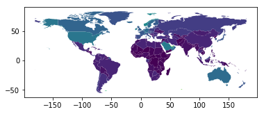


```python
world.plot(column='gdp_per_cap', cmap='OrRd', scheme='quantiles')
```


    <matplotlib.axes._subplots.AxesSubplot at 0x7fba839a5be0>


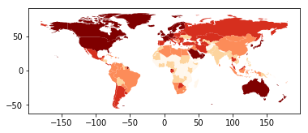


```python
seoul = gpd.read_file('asset/seoul_shp')
```


```python
seoul.plot(column='name')
```


    <matplotlib.axes._subplots.AxesSubplot at 0x7fba7b391908>


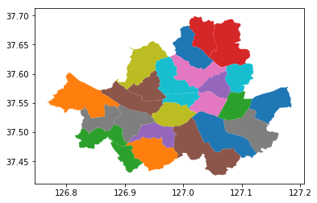


```python
seoul.head()
```


<div>
<style scoped>
    .dataframe tbody tr th:only-of-type {
        vertical-align: middle;
    }

    .dataframe tbody tr th {
        vertical-align: top;
    }

    .dataframe thead th {
        text-align: right;
    }
</style>
<table border="1" class="dataframe">
  <thead>
    <tr style="text-align: right;">
      <th></th>
      <th>code</th>
      <th>name</th>
      <th>name_eng</th>
      <th>base_year</th>
      <th>geometry</th>
    </tr>
  </thead>
  <tbody>
    <tr>
      <th>0</th>
      <td>11250</td>
      <td>강동구</td>
      <td>Gangdong-gu</td>
      <td>2013</td>
      <td>POLYGON ((127.1151958498161 37.55753318070492,...</td>
    </tr>
    <tr>
      <th>1</th>
      <td>11240</td>
      <td>송파구</td>
      <td>Songpa-gu</td>
      <td>2013</td>
      <td>POLYGON ((127.0690698130372 37.52227942350503,...</td>
    </tr>
    <tr>
      <th>2</th>
      <td>11230</td>
      <td>강남구</td>
      <td>Gangnam-gu</td>
      <td>2013</td>
      <td>POLYGON ((127.058673592884 37.52629974922568, ...</td>
    </tr>
    <tr>
      <th>3</th>
      <td>11220</td>
      <td>서초구</td>
      <td>Seocho-gu</td>
      <td>2013</td>
      <td>POLYGON ((127.0139711966751 37.52503988289669,...</td>
    </tr>
    <tr>
      <th>4</th>
      <td>11210</td>
      <td>관악구</td>
      <td>Gwanak-gu</td>
      <td>2013</td>
      <td>POLYGON ((126.9610898906183 37.49100376129394,...</td>
    </tr>
  </tbody>
</table>
</div>


```python
seoul['coords'] = seoul['geometry'].apply(lambda x: x.representative_point().coords[:])
seoul['coords'] = [coords[0] for coords in seoul['coords']]
```


```python
world = gpd.read_file(gpd.datasets.get_path('naturalearth_lowres')) 
cities = gpd.read_file(gpd.datasets.get_path('naturalearth_cities')) 
 

base = world.plot(color='white', edgecolor='black')

cities.plot(ax=base, marker='o', color='red', markersize=5);
```


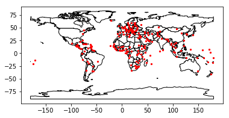


```python
import matplotlib.pyplot as plt
import matplotlib.font_manager as fm
```


```python
font_list = fm.findSystemFonts(fontpaths=None, fontext='ttf')
for font in font_list:
    print(font)
```

    /usr/share/fonts/truetype/msttcorefonts/Georgia.ttf
    /usr/share/texmf/fonts/opentype/public/tex-gyre/texgyrecursor-italic.otf
    /usr/share/texmf/fonts/opentype/public/lm/lmsans12-oblique.otf
    /usr/share/fonts/truetype/liberation/LiberationSerif-Regular.ttf
    /usr/share/fonts/truetype/lato/Lato-Regular.ttf
    /usr/share/fonts/truetype/dejavu/DejaVuSerifCondensed.ttf
    /usr/share/fonts/truetype/liberation/LiberationMono-Bold.ttf
    /usr/share/fonts/truetype/msttcorefonts/Andale_Mono.ttf
    /usr/share/texmf/fonts/opentype/public/tex-gyre/texgyreheroscn-bold.otf
    /usr/share/fonts/truetype/arphic-bkai00mp/bkai00mp.ttf
    /usr/share/fonts/truetype/dejavu/DejaVuSansCondensed-Oblique.ttf
    /usr/share/fonts/truetype/nanum/NanumPen.ttf
    /usr/share/fonts/truetype/msttcorefonts/Trebuchet_MS_Bold.ttf
    /usr/share/fonts/korean/NanumMyeongjo.ttf
    /usr/share/fonts/truetype/msttcorefonts/cour.ttf
    /usr/share/texmf/fonts/opentype/public/tex-gyre/texgyrebonum-bold.otf
    /usr/share/fonts/korean/NanumGothicLight.ttf
    /usr/share/texmf/fonts/opentype/public/lm/lmsans12-regular.otf
    /usr/share/fonts/truetype/msttcorefonts/Times_New_Roman_Bold_Italic.ttf
    /usr/share/texmf/fonts/opentype/public/lm/lmsans8-oblique.otf
    /usr/share/fonts/truetype/unfonts-core/UnGraphicBold.ttf
    /usr/share/texmf/fonts/opentype/public/lm/lmsans17-regular.otf
    /usr/share/fonts/truetype/nanum/NanumSquareRoundB.ttf
    /usr/share/texmf/fonts/opentype/public/lm/lmsans17-oblique.otf
    /usr/share/fonts/opentype/ipafont-mincho/ipamp.ttf
    /usr/share/texmf/fonts/opentype/public/lm/lmsansquot8-regular.otf
    /usr/share/texmf/fonts/opentype/public/lm/lmmonoprop10-regular.otf
    /usr/share/fonts/truetype/unfonts-core/UnPilgi.ttf
    /usr/share/fonts/truetype/nanum/NanumSquareEB.ttf
    /usr/share/texmf/fonts/opentype/public/lm/lmsans10-regular.otf
    /usr/share/texmf/fonts/opentype/public/tex-gyre/texgyretermes-regular.otf
    /usr/share/fonts/truetype/nanum/NanumGothic.ttf
    /usr/share/texmf/fonts/opentype/public/lm/lmmono12-regular.otf
    /usr/share/fonts/truetype/dejavu/DejaVuSansMono-Bold.ttf
    /usr/share/texmf/fonts/opentype/public/lm/lmmono10-regular.otf
    /usr/share/texmf/fonts/opentype/public/tex-gyre/texgyreschola-bold.otf
    /usr/share/fonts/truetype/msttcorefonts/times.ttf
    /usr/share/texmf/fonts/opentype/public/lm/lmroman10-italic.otf
    /usr/share/fonts/truetype/msttcorefonts/trebuc.ttf
    /usr/share/fonts/truetype/msttcorefonts/Times_New_Roman_Italic.ttf
    /usr/share/texmf/fonts/opentype/public/lm/lmroman9-bold.otf
    /usr/share/fonts/truetype/liberation/LiberationSansNarrow-Regular.ttf
    /usr/share/fonts/korean/NanumBarunGothic.ttf
    /usr/share/texmf/fonts/opentype/public/tex-gyre/texgyreschola-regular.otf
    /usr/share/texmf/fonts/opentype/public/lm/lmromanslant9-regular.otf
    /usr/share/texmf/fonts/opentype/public/tex-gyre/texgyrepagella-italic.otf
    /usr/share/texmf/fonts/opentype/public/lm/lmsansdemicond10-regular.otf
    /usr/share/fonts/truetype/lato/Lato-MediumItalic.ttf
    /usr/share/fonts/truetype/dejavu/DejaVuSansCondensed.ttf
    /usr/share/fonts/korean/NanumSquareRoundEB.ttf
    /usr/share/texmf/fonts/opentype/public/lm/lmmonolt10-regular.otf
    /usr/share/fonts/truetype/lato/Lato-Light.ttf
    /usr/share/fonts/korean/NanumBarunGothicBold.ttf
    /usr/share/texmf/fonts/opentype/public/lm/lmromandemi10-oblique.otf
    /usr/share/fonts/truetype/msttcorefonts/trebucbd.ttf
    /usr/share/fonts/truetype/liberation/LiberationSansNarrow-BoldItalic.ttf
    /usr/share/texmf/fonts/opentype/public/tex-gyre/texgyreheros-regular.otf
    /usr/share/fonts/truetype/msttcorefonts/Arial_Bold.ttf
    /usr/share/fonts/truetype/nanum/NanumBarunGothic.ttf
    /usr/share/fonts/truetype/dejavu/DejaVuSerif-Italic.ttf
    /usr/share/texmf/fonts/opentype/public/lm/lmroman7-bold.otf
    /usr/share/fonts/truetype/msttcorefonts/courbd.ttf
    /usr/share/fonts/truetype/liberation/LiberationSerif-BoldItalic.ttf
    /usr/share/fonts/truetype/dejavu/DejaVuSansMono-Oblique.ttf
    /usr/share/texmf/fonts/opentype/public/lm/lmroman12-italic.otf
    /usr/share/texmf/fonts/opentype/public/lm/lmroman8-italic.otf
    /usr/share/texmf/fonts/opentype/public/lm/lmroman9-italic.otf
    /usr/share/texmf/fonts/opentype/public/lm/lmroman12-bold.otf
    /usr/share/fonts/truetype/arphic-gkai00mp/gkai00mp.ttf
    /usr/share/texmf/fonts/opentype/public/lm/lmroman5-bold.otf
    /usr/share/fonts/truetype/lato/Lato-Medium.ttf
    /usr/share/fonts/truetype/unfonts-core/UnDotumBold.ttf
    /usr/share/fonts/truetype/nanum/NanumMyeongjoExtraBold.ttf
    /usr/share/fonts/truetype/dejavu/DejaVuSansMono-BoldOblique.ttf
    /usr/share/texmf/fonts/opentype/public/lm/lmmonocaps10-regular.otf
    /usr/share/texmf/fonts/opentype/public/tex-gyre/texgyreadventor-bold.otf
    /usr/share/fonts/truetype/unfonts-core/UnGungseo.ttf
    /usr/share/fonts/truetype/dejavu/DejaVuMathTeXGyre.ttf
    /usr/share/fonts/truetype/lato/Lato-HairlineItalic.ttf
    /usr/share/fonts/truetype/nanum/NanumBarunpenR.ttf
    /usr/share/fonts/truetype/nanum/NanumBarunGothicBold.ttf
    /usr/share/fonts/truetype/unfonts-core/UnPilgiBold.ttf
    /usr/share/fonts/truetype/nanum/NanumSquareL.ttf
    /usr/share/texmf/fonts/opentype/public/lm/lmromancaps10-regular.otf
    /usr/share/texmf/fonts/opentype/public/tex-gyre/texgyreheroscn-bolditalic.otf
    /usr/share/fonts/truetype/liberation/LiberationSans-Regular.ttf
    /usr/share/texmf/fonts/opentype/public/lm/lmroman12-regular.otf
    /usr/share/fonts/truetype/nanum/NanumMyeongjoEco.ttf
    /usr/share/fonts/truetype/msttcorefonts/timesi.ttf
    /usr/share/texmf/fonts/opentype/public/tex-gyre/texgyrebonum-bolditalic.otf
    /usr/share/texmf/fonts/opentype/public/lm/lmroman6-regular.otf
    /usr/share/fonts/truetype/msttcorefonts/timesbd.ttf
    /usr/share/fonts/truetype/nanum/NanumBarunGothicUltraLight.ttf
    /usr/share/fonts/korean/NanumGothic.ttf
    /usr/share/fonts/korean/NanumPen.ttf
    /usr/share/texmf/fonts/opentype/public/tex-gyre/texgyrecursor-bold.otf
    /usr/share/fonts/truetype/msttcorefonts/verdanaz.ttf
    /usr/share/texmf/fonts/opentype/public/lm/lmsansquot8-boldoblique.otf
    /usr/share/texmf/fonts/opentype/public/tex-gyre-math/texgyreschola-math.otf
    /usr/share/texmf/fonts/opentype/public/lm/lmsans10-boldoblique.otf
    /usr/share/fonts/truetype/fonts-japanese-mincho.ttf
    /usr/share/fonts/truetype/dejavu/DejaVuSans-Bold.ttf
    /usr/share/texmf/fonts/opentype/public/lm/lmromanunsl10-regular.otf
    /usr/share/fonts/opentype/ipaexfont-mincho/ipaexm.ttf
    /usr/share/fonts/korean/NanumSquareB.ttf
    /usr/share/fonts/truetype/msttcorefonts/courbi.ttf
    /usr/share/fonts/korean/NanumBarunpenB.ttf
    /usr/share/texmf/fonts/opentype/public/lm/lmmonoltcond10-oblique.otf
    /usr/share/texmf/fonts/opentype/public/lm/lmmonoltcond10-regular.otf
    /usr/share/texmf/fonts/opentype/public/lm/lmromandunh10-oblique.otf
    /usr/share/fonts/truetype/nanum/NanumMyeongjoEcoExtraBold.ttf
    /usr/share/fonts/truetype/nanum/NanumMyeongjoEcoBold.ttf
    /usr/share/texmf/fonts/opentype/public/lm/lmmono10-italic.otf
    /usr/share/texmf/fonts/opentype/public/lm/lmroman6-bold.otf
    /usr/share/texmf/fonts/opentype/public/lm/lmmonoproplt10-boldoblique.otf
    /usr/share/fonts/truetype/unfonts-extra/UnShinmun.ttf
    /usr/share/fonts/truetype/dejavu/DejaVuSansCondensed-Bold.ttf
    /usr/share/fonts/truetype/lato/Lato-Bold.ttf
    /usr/share/texmf/fonts/opentype/public/tex-gyre/texgyreheros-bolditalic.otf
    /usr/share/texmf/fonts/opentype/public/tex-gyre/texgyrechorus-mediumitalic.otf
    /usr/share/fonts/truetype/msttcorefonts/Arial_Black.ttf
    /usr/share/fonts/truetype/msttcorefonts/Georgia_Bold.ttf
    /usr/share/texmf/fonts/opentype/public/tex-gyre/texgyreheros-bold.otf
    /usr/share/fonts/truetype/nanum/NanumSquareRoundL.ttf
    /usr/share/texmf/fonts/opentype/public/lm/lmsansquot8-bold.otf
    /usr/share/fonts/truetype/dejavu/DejaVuSans-Oblique.ttf
    /usr/share/fonts/korean/NanumSquareRoundR.ttf
    /usr/share/fonts/truetype/noto/NotoMono-Regular.ttf
    /usr/share/texmf/fonts/opentype/public/lm/lmmonoproplt10-regular.otf
    /usr/share/fonts/truetype/msttcorefonts/ariblk.ttf
    /usr/share/fonts/truetype/msttcorefonts/verdanab.ttf
    /usr/share/fonts/truetype/msttcorefonts/webdings.ttf
    /usr/share/texmf/fonts/opentype/public/lm/lmmonoslant10-regular.otf
    /usr/share/fonts/korean/NanumGothicBold.ttf
    /usr/share/fonts/truetype/nanum/NanumSquareRoundEB.ttf
    /usr/share/fonts/truetype/dejavu/DejaVuSerifCondensed-Bold.ttf
    /usr/share/texmf/fonts/opentype/public/lm/lmroman10-bolditalic.otf
    /usr/share/fonts/korean/NanumBarunGothicLight.ttf
    /usr/share/fonts/truetype/padauk/Padauk-Bold.ttf
    /usr/share/fonts/truetype/msttcorefonts/georgia.ttf
    /usr/share/fonts/truetype/msttcorefonts/Times_New_Roman.ttf
    /usr/share/fonts/truetype/dejavu/DejaVuSerifCondensed-Italic.ttf
    /usr/share/fonts/truetype/nanum/NanumGothicCoding.ttf
    /usr/share/fonts/truetype/unfonts-core/UnGraphic.ttf
    /usr/share/texmf/fonts/opentype/public/lm/lmroman5-regular.otf
    /usr/share/texmf/fonts/opentype/public/tex-gyre-math/texgyrepagella-math.otf
    /usr/share/fonts/truetype/msttcorefonts/arialbi.ttf
    /usr/share/texmf/fonts/opentype/public/lm/lmmonoproplt10-bold.otf
    /usr/share/fonts/truetype/lato/Lato-BoldItalic.ttf
    /usr/share/fonts/truetype/liberation/LiberationMono-Italic.ttf
    /usr/share/fonts/opentype/ipafont-mincho/ipam.ttf
    /usr/share/fonts/truetype/dejavu/DejaVuSerif-BoldItalic.ttf
    /usr/share/fonts/truetype/msttcorefonts/Comic_Sans_MS_Bold.ttf
    /usr/share/fonts/truetype/padauk/PadaukBook-Bold.ttf
    /usr/share/fonts/truetype/msttcorefonts/Arial_Italic.ttf
    /usr/share/fonts/korean/NanumMyeongjoBold.ttf
    /usr/share/texmf/fonts/opentype/public/tex-gyre/texgyrebonum-regular.otf
    /usr/share/fonts/truetype/unfonts-core/UnDotum.ttf
    /usr/share/texmf/fonts/opentype/public/tex-gyre/texgyreheroscn-italic.otf
    /usr/share/fonts/truetype/nanum/NanumBarunGothicLight.ttf
    /usr/share/texmf/fonts/opentype/public/lm/lmsansquot8-oblique.otf
    /usr/share/texmf/fonts/opentype/public/tex-gyre-math/texgyretermes-math.otf
    /usr/share/texmf/fonts/opentype/public/lm/lmromanslant10-regular.otf
    /usr/share/fonts/truetype/nanum/NanumSquareB.ttf
    /usr/share/texmf/fonts/opentype/public/lm/lmroman9-regular.otf
    /usr/share/fonts/truetype/lato/Lato-SemiboldItalic.ttf
    /usr/share/fonts/truetype/msttcorefonts/verdana.ttf
    /usr/share/texmf/fonts/opentype/public/lm/lmsans10-bold.otf
    /usr/share/fonts/truetype/dejavu/DejaVuSans-ExtraLight.ttf
    /usr/share/texmf/fonts/opentype/public/lm/lmmono8-regular.otf
    /usr/share/fonts/truetype/nanum/NanumGothicEcoBold.ttf
    /usr/share/fonts/truetype/lato/Lato-BlackItalic.ttf
    /usr/share/fonts/truetype/unfonts-extra/UnJamoDotum.ttf
    /usr/share/fonts/truetype/lato/Lato-Semibold.ttf
    /usr/share/texmf/fonts/opentype/public/lm/lmromandemi10-regular.otf
    /usr/share/texmf/fonts/opentype/public/lm/lmroman8-bold.otf
    /usr/share/fonts/truetype/unfonts-extra/UnYetgul.ttf
    /usr/share/fonts/truetype/nanum/NanumGothicExtraBold.ttf
    /usr/share/fonts/truetype/dejavu/DejaVuSansCondensed-BoldOblique.ttf
    /usr/share/texmf/fonts/opentype/public/tex-gyre/texgyreschola-italic.otf
    /usr/share/fonts/truetype/msttcorefonts/Webdings.ttf
    /usr/share/fonts/truetype/liberation/LiberationSansNarrow-Bold.ttf
    /usr/share/fonts/korean/NanumSquareR.ttf
    /usr/share/fonts/truetype/lato/Lato-Italic.ttf
    /usr/share/texmf/fonts/opentype/public/tex-gyre/texgyrecursor-bolditalic.otf
    /usr/share/texmf/fonts/opentype/public/lm/lmsans9-oblique.otf
    /usr/share/fonts/truetype/dejavu/DejaVuSerif-Bold.ttf
    /usr/share/fonts/truetype/nanum/NanumMyeongjo.ttf
    /usr/share/fonts/truetype/padauk/Padauk-Regular.ttf
    /usr/share/fonts/truetype/msttcorefonts/ariali.ttf
    /usr/share/fonts/truetype/msttcorefonts/andalemo.ttf
    /usr/share/fonts/truetype/msttcorefonts/Courier_New.ttf
    /usr/share/fonts/truetype/msttcorefonts/impact.ttf
    /usr/share/texmf/fonts/opentype/public/lm/lmmonocaps10-oblique.otf
    /usr/share/fonts/truetype/fonts-japanese-gothic.ttf
    /usr/share/fonts/truetype/msttcorefonts/Arial.ttf
    /usr/share/fonts/truetype/msttcorefonts/Trebuchet_MS.ttf
    /usr/share/fonts/truetype/lato/Lato-Heavy.ttf
    /usr/share/texmf/fonts/opentype/public/lm/lmsans8-regular.otf
    /usr/share/texmf/fonts/opentype/public/tex-gyre/texgyrecursor-regular.otf
    /usr/share/fonts/truetype/unfonts-extra/UnJamoBatang.ttf
    /usr/share/fonts/truetype/msttcorefonts/comicbd.ttf
    /usr/share/texmf/fonts/opentype/public/lm/lmromandunh10-regular.otf
    /usr/share/texmf/fonts/opentype/public/lm/lmmonolt10-oblique.otf
    /usr/share/fonts/truetype/msttcorefonts/georgiab.ttf
    /usr/share/texmf/fonts/opentype/public/tex-gyre/texgyrepagella-bold.otf
    /usr/share/fonts/truetype/msttcorefonts/comic.ttf
    /usr/share/fonts/truetype/liberation/LiberationSansNarrow-Italic.ttf
    /usr/share/texmf/fonts/opentype/public/tex-gyre/texgyreschola-bolditalic.otf
    /usr/share/fonts/truetype/msttcorefonts/Trebuchet_MS_Italic.ttf
    /usr/share/fonts/truetype/lato/Lato-ThinItalic.ttf
    /usr/share/fonts/truetype/msttcorefonts/Trebuchet_MS_Bold_Italic.ttf
    /usr/share/texmf/fonts/opentype/public/tex-gyre/texgyreadventor-italic.otf
    /usr/share/fonts/korean/NanumGothicExtraBold.ttf
    /usr/share/fonts/truetype/unfonts-core/UnDinaruBold.ttf
    /usr/share/fonts/truetype/nanum/NanumSquareR.ttf
    /usr/share/texmf/fonts/opentype/public/lm/lmroman10-bold.otf
    /usr/share/fonts/truetype/msttcorefonts/Arial_Bold_Italic.ttf
    /usr/share/fonts/truetype/msttcorefonts/couri.ttf
    /usr/share/fonts/truetype/droid/DroidSansFallbackFull.ttf
    /usr/share/fonts/opentype/ipaexfont-gothic/ipaexg.ttf
    /usr/share/fonts/korean/NanumMyeongjoExtraBold.ttf
    /usr/share/fonts/truetype/nanum/NanumGothicEco.ttf
    /usr/share/fonts/korean/NanumSquareRoundB.ttf
    /usr/share/texmf/fonts/opentype/public/tex-gyre/texgyreadventor-bolditalic.otf
    /usr/share/fonts/truetype/dejavu/DejaVuSansMono.ttf
    /usr/share/fonts/korean/NanumSquareL.ttf
    /usr/share/fonts/truetype/msttcorefonts/georgiaz.ttf
    /usr/share/fonts/truetype/msttcorefonts/arialbd.ttf
    /usr/share/fonts/truetype/msttcorefonts/Verdana_Italic.ttf
    /usr/share/texmf/fonts/opentype/public/lm/lmsansdemicond10-oblique.otf
    /usr/share/fonts/truetype/msttcorefonts/Verdana_Bold.ttf
    /usr/share/texmf/fonts/opentype/public/lm/lmromancaps10-oblique.otf
    /usr/share/fonts/truetype/unfonts-extra/UnJamoSora.ttf
    /usr/share/fonts/truetype/nanum/NanumGothicCoding-Bold.ttf
    /usr/share/fonts/truetype/baekmuk/dotum.ttf
    /usr/share/fonts/truetype/msttcorefonts/Impact.ttf
    /usr/share/fonts/truetype/unfonts-extra/UnPenheulim.ttf
    /usr/share/texmf/fonts/opentype/public/lm/lmsans10-oblique.otf
    /usr/share/fonts/truetype/baekmuk/hline.ttf
    /usr/share/texmf/fonts/opentype/public/lm/lmroman7-italic.otf
    /usr/share/texmf/fonts/opentype/public/tex-gyre/texgyreadventor-regular.otf
    /usr/share/fonts/truetype/msttcorefonts/trebucit.ttf
    /usr/share/fonts/truetype/msttcorefonts/arial.ttf
    /usr/share/texmf/fonts/opentype/public/lm/lmromanslant10-bold.otf
    /usr/share/fonts/truetype/liberation/LiberationMono-BoldItalic.ttf
    /usr/share/fonts/truetype/nanum/NanumBrush.ttf
    /usr/share/fonts/korean/NanumBarunpenR.ttf
    /usr/share/fonts/truetype/lato/Lato-Thin.ttf
    /usr/share/fonts/truetype/nanum/NanumGothicBold.ttf
    /usr/share/texmf/fonts/opentype/public/lm/lmmonolt10-boldoblique.otf
    /usr/share/fonts/truetype/msttcorefonts/Verdana_Bold_Italic.ttf
    /usr/share/fonts/truetype/dejavu/DejaVuSans-BoldOblique.ttf
    /usr/share/fonts/truetype/unfonts-extra/UnPilgia.ttf
    /usr/share/fonts/truetype/msttcorefonts/timesbi.ttf
    /usr/share/texmf/fonts/opentype/public/lm/lmroman7-regular.otf
    /usr/share/fonts/opentype/ipafont-gothic/ipag.ttf
    /usr/share/texmf/fonts/opentype/public/tex-gyre/texgyreheroscn-regular.otf
    /usr/share/fonts/korean/NanumSquareRoundL.ttf
    /usr/share/fonts/truetype/msttcorefonts/Courier_New_Italic.ttf
    /usr/share/fonts/truetype/baekmuk/batang.ttf
    /usr/share/fonts/truetype/unfonts-extra/UnJamoNovel.ttf
    /usr/share/texmf/fonts/opentype/public/tex-gyre-math/texgyrebonum-math.otf
    /usr/share/fonts/truetype/msttcorefonts/Courier_New_Bold.ttf
    /usr/share/texmf/fonts/opentype/public/tex-gyre/texgyrepagella-regular.otf
    /usr/share/fonts/truetype/msttcorefonts/verdanai.ttf
    /usr/share/fonts/truetype/liberation/LiberationSans-BoldItalic.ttf
    /usr/share/fonts/truetype/msttcorefonts/trebucbi.ttf
    /usr/share/fonts/truetype/unfonts-extra/UnPen.ttf
    /usr/share/fonts/truetype/nanum/NanumBarunpenB.ttf
    /usr/share/fonts/truetype/liberation/LiberationMono-Regular.ttf
    /usr/share/texmf/fonts/opentype/public/tex-gyre-math/texgyredejavu-math.otf
    /usr/share/fonts/truetype/padauk/PadaukBook-Regular.ttf
    /usr/share/fonts/opentype/ipafont-gothic/ipagp.ttf
    /usr/share/fonts/korean/NanumBarunGothicUltraLight.ttf
    /usr/share/texmf/fonts/opentype/public/tex-gyre/texgyretermes-bolditalic.otf
    /usr/share/fonts/korean/NanumBrush.ttf
    /usr/share/fonts/truetype/arphic-bsmi00lp/bsmi00lp.ttf
    /usr/share/texmf/fonts/opentype/public/lm/lmmonolt10-bold.otf
    /usr/share/fonts/truetype/dejavu/DejaVuSerifCondensed-BoldItalic.ttf
    /usr/share/fonts/truetype/unfonts-extra/UnVada.ttf
    /usr/share/fonts/truetype/unfonts-extra/UnTaza.ttf
    /usr/share/fonts/truetype/msttcorefonts/Georgia_Italic.ttf
    /usr/share/fonts/truetype/unfonts-core/UnDinaruLight.ttf
    /usr/share/fonts/truetype/dejavu/DejaVuSans.ttf
    /usr/share/texmf/fonts/opentype/public/lm/lmmono9-regular.otf
    /usr/share/fonts/truetype/msttcorefonts/Courier_New_Bold_Italic.ttf
    /usr/share/texmf/fonts/opentype/public/tex-gyre/texgyretermes-italic.otf
    /usr/share/fonts/truetype/msttcorefonts/georgiai.ttf
    /usr/share/fonts/truetype/liberation/LiberationSans-Italic.ttf
    /usr/share/fonts/truetype/unfonts-core/UnBatang.ttf
    /usr/share/fonts/truetype/liberation/LiberationSans-Bold.ttf
    /usr/share/fonts/truetype/lato/Lato-HeavyItalic.ttf
    /usr/share/texmf/fonts/opentype/public/lm/lmromanslant8-regular.otf
    /usr/share/texmf/fonts/opentype/public/lm/lmroman8-regular.otf
    /usr/share/texmf/fonts/opentype/public/lm/lmromanslant12-regular.otf
    /usr/share/fonts/truetype/nanum/NanumSquareRoundR.ttf
    /usr/share/texmf/fonts/opentype/public/lm-math/latinmodern-math.otf
    /usr/share/fonts/truetype/arphic-gbsn00lp/gbsn00lp.ttf
    /usr/share/fonts/truetype/lato/Lato-Black.ttf
    /usr/share/texmf/fonts/opentype/public/tex-gyre/texgyreheros-italic.otf
    /usr/share/texmf/fonts/opentype/public/lm/lmmonoprop10-oblique.otf
    /usr/share/texmf/fonts/opentype/public/lm/lmroman10-regular.otf
    /usr/share/texmf/fonts/opentype/public/lm/lmsans9-regular.otf
    /usr/share/fonts/truetype/msttcorefonts/Verdana.ttf
    /usr/share/fonts/truetype/baekmuk/gulim.ttf
    /usr/share/fonts/truetype/msttcorefonts/Georgia_Bold_Italic.ttf
    /usr/share/texmf/fonts/opentype/public/tex-gyre/texgyrepagella-bolditalic.otf
    /usr/share/fonts/truetype/nanum/NanumMyeongjoBold.ttf
    /usr/share/fonts/truetype/unfonts-core/UnDinaru.ttf
    /usr/share/fonts/truetype/liberation/LiberationSerif-Bold.ttf
    /usr/share/fonts/truetype/liberation/LiberationSerif-Italic.ttf
    /usr/share/texmf/fonts/opentype/public/tex-gyre/texgyrebonum-italic.otf
    /usr/share/texmf/fonts/opentype/public/lm/lmmonoproplt10-oblique.otf
    /usr/share/texmf/fonts/opentype/public/lm/lmromanslant17-regular.otf
    /usr/share/texmf/fonts/opentype/public/lm/lmroman17-regular.otf
    /usr/share/fonts/truetype/lato/Lato-Hairline.ttf
    /usr/share/fonts/truetype/nanum/NanumGothicLight.ttf
    /usr/share/fonts/korean/NanumSquareEB.ttf
    /usr/share/fonts/truetype/unfonts-core/UnBatangBold.ttf
    /usr/share/fonts/truetype/dejavu/DejaVuSerif.ttf
    /usr/share/fonts/truetype/lato/Lato-LightItalic.ttf
    /usr/share/fonts/truetype/nanum/NanumGothicEcoExtraBold.ttf
    /usr/share/fonts/truetype/msttcorefonts/Times_New_Roman_Bold.ttf
    /usr/share/fonts/truetype/msttcorefonts/Comic_Sans_MS.ttf
    /usr/share/texmf/fonts/opentype/public/tex-gyre/texgyretermes-bold.otf


```python
plt.rcParams["font.family"] = 'NanumMyeongjo'
plt.rcParams["font.size"] = 12
plt.rcParams["figure.figsize"] = (14,4)
```


```python
seoul.plot(column='name')
for idx, row in seoul.iterrows():
    plt.annotate(s=row['name'], xy=row['coords'],
                 horizontalalignment='center')
```


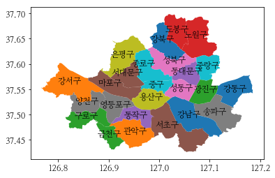


```python
import matplotlib.pyplot as plt
```


```python
import matplotlib.pyplot as plt
fig, ax = plt.subplots()
seoul.plot(ax= ax, column='name')
```


    <matplotlib.axes._subplots.AxesSubplot at 0x7fba7ab08c88>


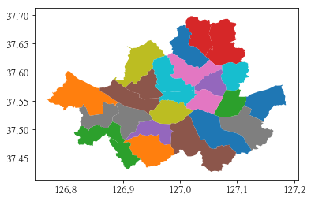


```python
seoul_x = seoul.centroid.apply(lambda p: p.x)
seoul_y = seoul.centroid.apply(lambda p: p.y)
```


```python
len(seoul_x)
```


    25


```python
seoulcen = seoul.copy()
seoulcen['geometry'] = seoul.geometry.centroid
```


```python
seoul.plot(column='code', cmap='OrRd', scheme='quantiles')
for idx, row in seoulcen.iterrows():
    plt.annotate(s=row['name'], xy=[row['geometry'].x,row['geometry'].y],
                 horizontalalignment='center')
```


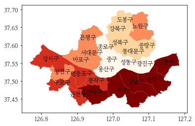


```python
for name, centroid in zip(seoul.name, seoul.centroid):
    print(name)
    # plt.text(centroid, name, fontsize=12)
```

    강동구
    송파구
    강남구
    서초구
    관악구
    동작구
    영등포구
    금천구
    구로구
    강서구
    양천구
    마포구
    서대문구
    은평구
    노원구
    도봉구
    강북구
    성북구
    중랑구
    동대문구
    광진구
    성동구
    용산구
    중구
    종로구


```python
world.head()
```


<div>
<style scoped>
    .dataframe tbody tr th:only-of-type {
        vertical-align: middle;
    }

    .dataframe tbody tr th {
        vertical-align: top;
    }

    .dataframe thead th {
        text-align: right;
    }
</style>
<table border="1" class="dataframe">
  <thead>
    <tr style="text-align: right;">
      <th></th>
      <th>pop_est</th>
      <th>continent</th>
      <th>name</th>
      <th>iso_a3</th>
      <th>gdp_md_est</th>
      <th>geometry</th>
    </tr>
  </thead>
  <tbody>
    <tr>
      <th>0</th>
      <td>920938</td>
      <td>Oceania</td>
      <td>Fiji</td>
      <td>FJI</td>
      <td>8374.0</td>
      <td>(POLYGON ((180 -16.06713266364245, 180 -16.555...</td>
    </tr>
    <tr>
      <th>1</th>
      <td>53950935</td>
      <td>Africa</td>
      <td>Tanzania</td>
      <td>TZA</td>
      <td>150600.0</td>
      <td>POLYGON ((33.90371119710453 -0.950000000000000...</td>
    </tr>
    <tr>
      <th>2</th>
      <td>603253</td>
      <td>Africa</td>
      <td>W. Sahara</td>
      <td>ESH</td>
      <td>906.5</td>
      <td>POLYGON ((-8.665589565454809 27.65642588959236...</td>
    </tr>
    <tr>
      <th>3</th>
      <td>35623680</td>
      <td>North America</td>
      <td>Canada</td>
      <td>CAN</td>
      <td>1674000.0</td>
      <td>(POLYGON ((-122.84 49.00000000000011, -122.974...</td>
    </tr>
    <tr>
      <th>4</th>
      <td>326625791</td>
      <td>North America</td>
      <td>United States of America</td>
      <td>USA</td>
      <td>18560000.0</td>
      <td>(POLYGON ((-122.84 49.00000000000011, -120 49....</td>
    </tr>
  </tbody>
</table>
</div>


```python
world = gpd.read_file(gpd.datasets.get_path('naturalearth_lowres'))

# Check original projection
# (it's Platte Carre! x-y are long and lat)
world.crs
```


    {'init': 'epsg:4326'}


```python
# Visualize
ax = world.plot()

ax.set_title("WGS84 (lat/lon)")
```


    Text(0.5, 1.0, 'WGS84 (lat/lon)')


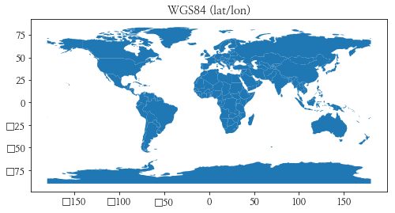


```python
# Reproject to Mercator (after dropping Antartica)
world = world[(world.name != "Antarctica") & (world.name != "Fr. S. Antarctic Lands")]

world = world.to_crs({'init': 'epsg:3395'}) # world.to_crs(epsg=3395) would also work

ax = world.plot()

ax.set_title("Mercator");
```


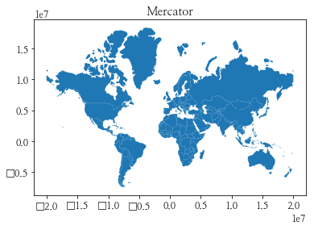


```python
from shapely.geometry import Polygon

p1 = Polygon([(0, 0), (1, 0), (1, 1), (0, 1)])
p2 = Polygon([(0, 0), (1, 0), (1, 1)])
p3 = Polygon([(2, 0), (3, 0), (3, 1), (2, 1)])

g = gpd.GeoSeries([p1, p2, p3])
g.plot(cmap='Pastel1')

```


    <matplotlib.axes._subplots.AxesSubplot at 0x7fba8dd6f2b0>


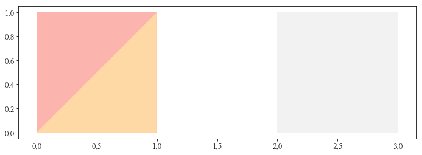


```python
g.buffer(0.5).plot(cmap='Pastel1')
```


    <matplotlib.axes._subplots.AxesSubplot at 0x7fba7ac44860>


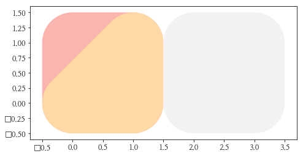


```python
nybb_path = gpd.datasets.get_path('nybb')
boros = gpd.GeoDataFrame.from_file(nybb_path) 
boros.set_index('BoroCode', inplace=True)
boros = boros.sort_index()
boros
```


<div>
<style scoped>
    .dataframe tbody tr th:only-of-type {
        vertical-align: middle;
    }

    .dataframe tbody tr th {
        vertical-align: top;
    }

    .dataframe thead th {
        text-align: right;
    }
</style>
<table border="1" class="dataframe">
  <thead>
    <tr style="text-align: right;">
      <th></th>
      <th>BoroName</th>
      <th>Shape_Leng</th>
      <th>Shape_Area</th>
      <th>geometry</th>
    </tr>
    <tr>
      <th>BoroCode</th>
      <th></th>
      <th></th>
      <th></th>
      <th></th>
    </tr>
  </thead>
  <tbody>
    <tr>
      <th>1</th>
      <td>Manhattan</td>
      <td>359299.096471</td>
      <td>6.364715e+08</td>
      <td>(POLYGON ((981219.0557861328 188655.3157958984...</td>
    </tr>
    <tr>
      <th>2</th>
      <td>Bronx</td>
      <td>464392.991824</td>
      <td>1.186925e+09</td>
      <td>(POLYGON ((1012821.805786133 229228.2645874023...</td>
    </tr>
    <tr>
      <th>3</th>
      <td>Brooklyn</td>
      <td>741080.523166</td>
      <td>1.937479e+09</td>
      <td>(POLYGON ((1021176.479003906 151374.7969970703...</td>
    </tr>
    <tr>
      <th>4</th>
      <td>Queens</td>
      <td>896344.047763</td>
      <td>3.045213e+09</td>
      <td>(POLYGON ((1029606.076599121 156073.8142089844...</td>
    </tr>
    <tr>
      <th>5</th>
      <td>Staten Island</td>
      <td>330470.010332</td>
      <td>1.623820e+09</td>
      <td>(POLYGON ((970217.0223999023 145643.3322143555...</td>
    </tr>
  </tbody>
</table>
</div>


```python
boros.plot(cmap='Pastel1')
```


    <matplotlib.axes._subplots.AxesSubplot at 0x7fba8dc5a0b8>


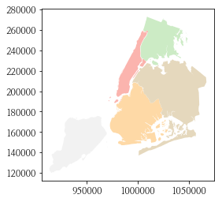


```python
from shapely.geometry import Point
import numpy as np

xmin, xmax, ymin, ymax = 900000, 1080000, 120000, 280000

xc = (xmax - xmin) * np.random.random(2000) + xmin

yc = (ymax - ymin) * np.random.random(2000) + ymin 

pts = gpd.GeoSeries([Point(x, y) for x, y in zip(xc, yc)])
```


```python
circles = pts.buffer(2000)
```


```python
mp = circles.unary_union
```


```python
holes = boros['geometry'].intersection(mp)
```


```python
holes.plot(cmap='Pastel1')
```


    <matplotlib.axes._subplots.AxesSubplot at 0x7fba8d9bf908>


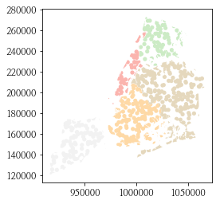


```python
circles = pts.buffer(2000) # 2000 안에 있는 Points만 남김

mp = circles.unary_union # circles를 하나로 합침

boros_with_holes = boros['geometry'].difference(mp)

boros_with_holes.plot(cmap='Pastel1')
```


    <matplotlib.axes._subplots.AxesSubplot at 0x7fba8d9b9860>


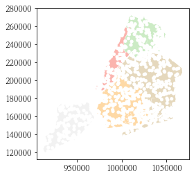


```python
world = gpd.read_file(gpd.datasets.get_path('naturalearth_lowres'))
world = world[['continent', 'geometry']]
continents = world.dissolve(by='continent')
continents.head()
```


<div>
<style scoped>
    .dataframe tbody tr th:only-of-type {
        vertical-align: middle;
    }

    .dataframe tbody tr th {
        vertical-align: top;
    }

    .dataframe thead th {
        text-align: right;
    }
</style>
<table border="1" class="dataframe">
  <thead>
    <tr style="text-align: right;">
      <th></th>
      <th>geometry</th>
    </tr>
    <tr>
      <th>continent</th>
      <th></th>
    </tr>
  </thead>
  <tbody>
    <tr>
      <th>Africa</th>
      <td>(POLYGON ((49.54351891459575 -12.4698328589405...</td>
    </tr>
    <tr>
      <th>Antarctica</th>
      <td>(POLYGON ((-163.7128956777287 -78.595667413241...</td>
    </tr>
    <tr>
      <th>Asia</th>
      <td>(POLYGON ((120.2950142762069 -10.2586499976035...</td>
    </tr>
    <tr>
      <th>Europe</th>
      <td>(POLYGON ((-51.65779741067889 4.15623240805302...</td>
    </tr>
    <tr>
      <th>North America</th>
      <td>(POLYGON ((-61.68000000000001 10.76, -61.105 1...</td>
    </tr>
  </tbody>
</table>
</div>


```python
plt.rcParams["font.family"] = 'DejaVu Sans'
```


```python
continents.plot()
```


    <matplotlib.axes._subplots.AxesSubplot at 0x7fba8de5d940>


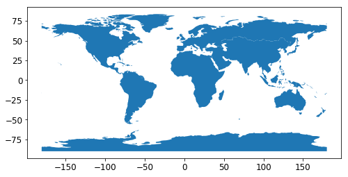


```python
world = gpd.read_file(gpd.datasets.get_path('naturalearth_lowres'))
world = world[['continent', 'geometry', 'pop_est']]
continents = world.dissolve(by='continent', aggfunc='sum')
continents.head()
```


<div>
<style scoped>
    .dataframe tbody tr th:only-of-type {
        vertical-align: middle;
    }

    .dataframe tbody tr th {
        vertical-align: top;
    }

    .dataframe thead th {
        text-align: right;
    }
</style>
<table border="1" class="dataframe">
  <thead>
    <tr style="text-align: right;">
      <th></th>
      <th>geometry</th>
      <th>pop_est</th>
    </tr>
    <tr>
      <th>continent</th>
      <th></th>
      <th></th>
    </tr>
  </thead>
  <tbody>
    <tr>
      <th>Africa</th>
      <td>(POLYGON ((49.54351891459575 -12.4698328589405...</td>
      <td>1219176238</td>
    </tr>
    <tr>
      <th>Antarctica</th>
      <td>(POLYGON ((-163.7128956777287 -78.595667413241...</td>
      <td>4050</td>
    </tr>
    <tr>
      <th>Asia</th>
      <td>(POLYGON ((120.2950142762069 -10.2586499976035...</td>
      <td>4389144868</td>
    </tr>
    <tr>
      <th>Europe</th>
      <td>(POLYGON ((-51.65779741067889 4.15623240805302...</td>
      <td>746398461</td>
    </tr>
    <tr>
      <th>North America</th>
      <td>(POLYGON ((-61.68000000000001 10.76, -61.105 1...</td>
      <td>573042112</td>
    </tr>
  </tbody>
</table>
</div>


```python
continents.plot(column = 'pop_est', scheme='quantiles', cmap='YlOrRd')
```


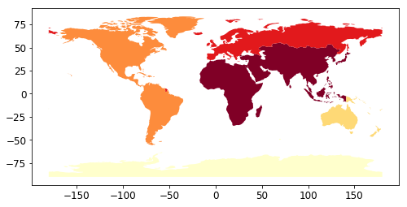


## IPA 주관 인공지능센터 기본(fundamental) 과정
- GitHub link: [here](https://github.com/Wind-Kyle/python-fundamentals/)
- E-Mail: windkyle7@gmail.com