## Seaborn
- 공식 홈페이지: https://seaborn.pydata.org/index.html
- 특징
  - Made with matplotlib
  - Easy coding when using pandas
  - Various color theme
  - Various statistical graphs


```python
import matplotlib
import matplotlib.pyplot as plt
import seaborn as sns
%matplotlib inline
```

현재 실습에 사용하는 `matplotlib`의 버전은 다음과 같다.


```python
matplotlib.__version__
```


    '3.0.3'


### tidy-data: iris 불러오기


```python
iris = sns.load_dataset('iris')
iris.sample(5)
```


<div>
<style scoped>
    .dataframe tbody tr th:only-of-type {
        vertical-align: middle;
    }

    .dataframe tbody tr th {
        vertical-align: top;
    }

    .dataframe thead th {
        text-align: right;
    }
</style>
<table border="1" class="dataframe">
  <thead>
    <tr style="text-align: right;">
      <th></th>
      <th>sepal_length</th>
      <th>sepal_width</th>
      <th>petal_length</th>
      <th>petal_width</th>
      <th>species</th>
    </tr>
  </thead>
  <tbody>
    <tr>
      <th>103</th>
      <td>6.3</td>
      <td>2.9</td>
      <td>5.6</td>
      <td>1.8</td>
      <td>virginica</td>
    </tr>
    <tr>
      <th>17</th>
      <td>5.1</td>
      <td>3.5</td>
      <td>1.4</td>
      <td>0.3</td>
      <td>setosa</td>
    </tr>
    <tr>
      <th>32</th>
      <td>5.2</td>
      <td>4.1</td>
      <td>1.5</td>
      <td>0.1</td>
      <td>setosa</td>
    </tr>
    <tr>
      <th>26</th>
      <td>5.0</td>
      <td>3.4</td>
      <td>1.6</td>
      <td>0.4</td>
      <td>setosa</td>
    </tr>
    <tr>
      <th>77</th>
      <td>6.7</td>
      <td>3.0</td>
      <td>5.0</td>
      <td>1.7</td>
      <td>versicolor</td>
    </tr>
  </tbody>
</table>
</div>


## Pair plot
- 모든 변수간 scatter plot을 나타냄
- 대각선은 변수 하나의 box plot
- 적당한 변수들 상관관계 분석 가능
- PairGrid과 동일하지만 보다 쉽게 그릴 수 있음


```python
sns.pairplot(iris)
```


    <seaborn.axisgrid.PairGrid at 0x7f63619add68>


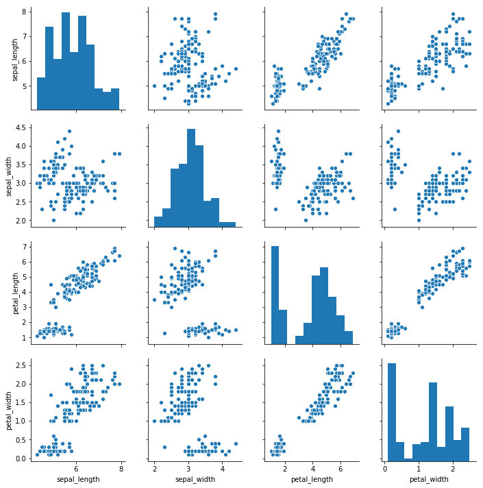


### pairplot 파라미터
- hue: plot 측면을 서로 다른 색상에 매핑하기 위한 데이터 변수
- kind: 정체성이 없는 관계를 위한 plot


```python
sns.pairplot(iris, hue='species')
```


    <seaborn.axisgrid.PairGrid at 0x7f635f256cc0>


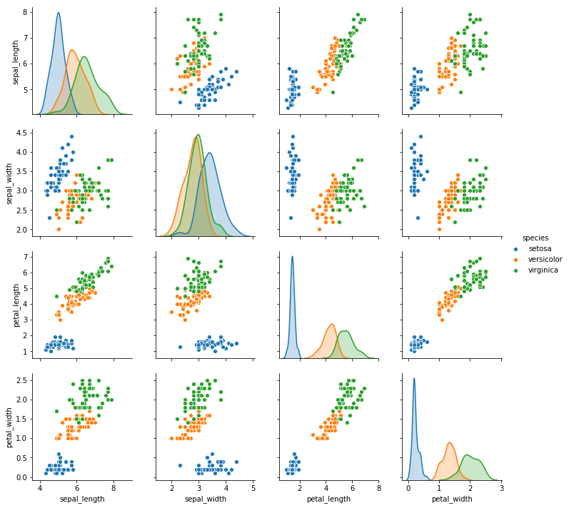


```python
sns.pairplot(iris, hue='species', kind='reg')
```


    <seaborn.axisgrid.PairGrid at 0x7f63ac5d8898>


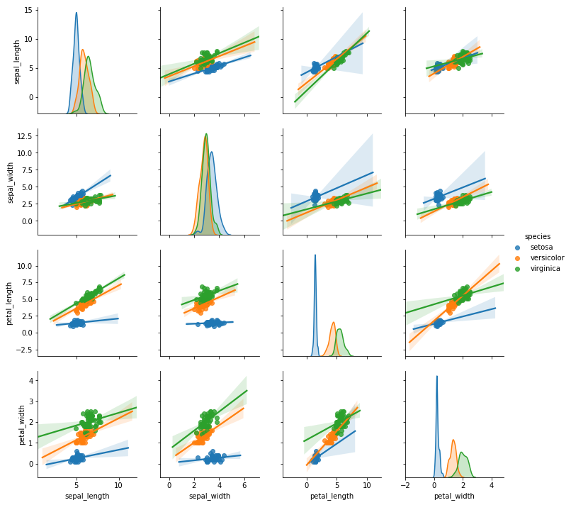


```python
sns.pairplot(iris,
             diag_kind='kde',
             markers='+',
             plot_kws=dict(s=50, edgecolor='b', linewidth=1),
             diag_kws=dict(shade=True))
```


    <seaborn.axisgrid.PairGrid at 0x7f635cc09390>


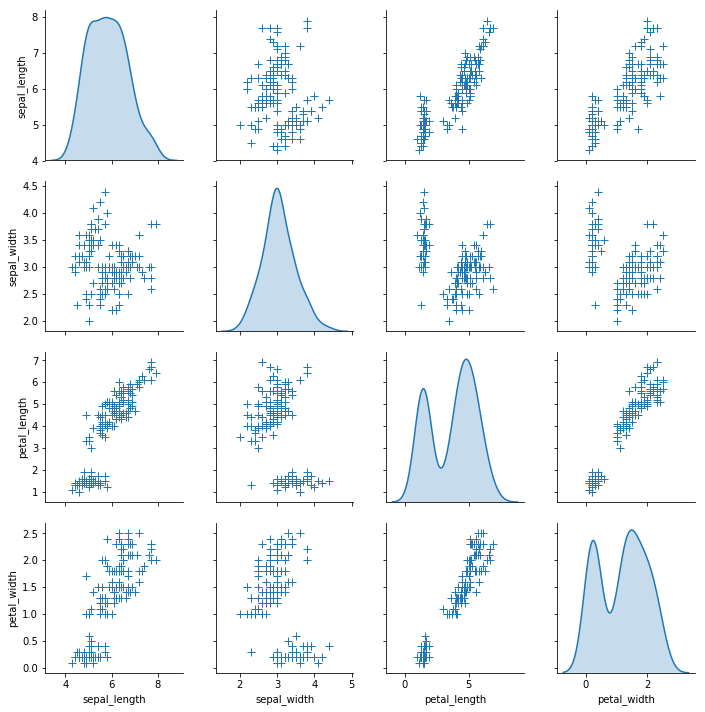


### tidy-data: tips 불러오기


```python
tips = sns.load_dataset('tips')
tips.sample(5)
```


<div>
<style scoped>
    .dataframe tbody tr th:only-of-type {
        vertical-align: middle;
    }

    .dataframe tbody tr th {
        vertical-align: top;
    }

    .dataframe thead th {
        text-align: right;
    }
</style>
<table border="1" class="dataframe">
  <thead>
    <tr style="text-align: right;">
      <th></th>
      <th>total_bill</th>
      <th>tip</th>
      <th>sex</th>
      <th>smoker</th>
      <th>day</th>
      <th>time</th>
      <th>size</th>
    </tr>
  </thead>
  <tbody>
    <tr>
      <th>224</th>
      <td>13.42</td>
      <td>1.58</td>
      <td>Male</td>
      <td>Yes</td>
      <td>Fri</td>
      <td>Lunch</td>
      <td>2</td>
    </tr>
    <tr>
      <th>94</th>
      <td>22.75</td>
      <td>3.25</td>
      <td>Female</td>
      <td>No</td>
      <td>Fri</td>
      <td>Dinner</td>
      <td>2</td>
    </tr>
    <tr>
      <th>233</th>
      <td>10.77</td>
      <td>1.47</td>
      <td>Male</td>
      <td>No</td>
      <td>Sat</td>
      <td>Dinner</td>
      <td>2</td>
    </tr>
    <tr>
      <th>119</th>
      <td>24.08</td>
      <td>2.92</td>
      <td>Female</td>
      <td>No</td>
      <td>Thur</td>
      <td>Lunch</td>
      <td>4</td>
    </tr>
    <tr>
      <th>148</th>
      <td>9.78</td>
      <td>1.73</td>
      <td>Male</td>
      <td>No</td>
      <td>Thur</td>
      <td>Lunch</td>
      <td>2</td>
    </tr>
  </tbody>
</table>
</div>


## FacetGrid
- 조건부 관계를 표시하기 위한 멀티 plot
- 데이터셋의 변수 level에 해당하는 행 및 열의 격자로 열거된 여러 축으로 데이터셋을 매핑

### 성별 기준으로 그리기


```python
g = sns.FacetGrid(tips, col='sex', hue='smoker')
g.map(plt.scatter, 'tip', 'total_bill')
g.add_legend()
```


    <seaborn.axisgrid.FacetGrid at 0x7f635c14e7b8>


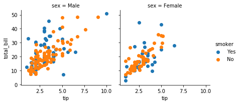


## PairGrid
- 데이터셋의 각 변수를 여러 축의 그리드에 있는 열과 행에 매핑


```python
g = sns.PairGrid(iris)
g = g.map(plt.scatter)
```


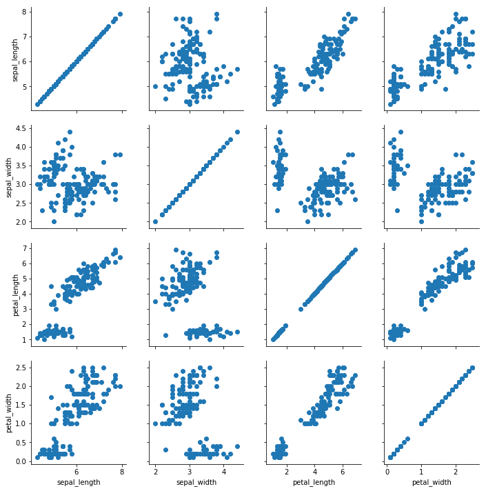


```python
g = sns.PairGrid(iris, hue='species')
g = g.map_diag(plt.hist)
g = g.map_offdiag(plt.scatter)
g = g.add_legend()
```


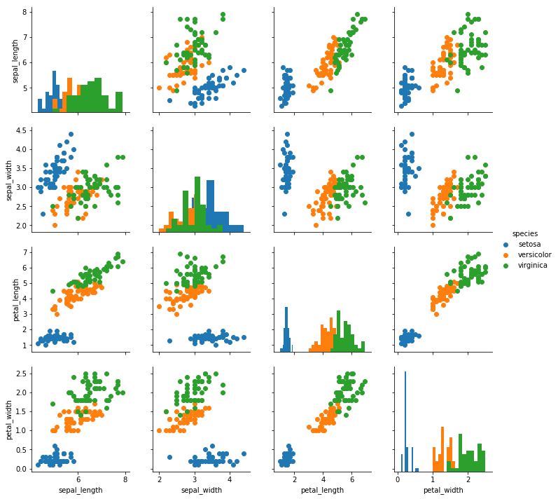


```python
g = sns.PairGrid(iris)
g = g.map_upper(plt.scatter)
g = g.map_lower(sns.kdeplot, cmap='Blues_d')
g = g.map_diag(sns.kdeplot, lw=3, legend=False)
```


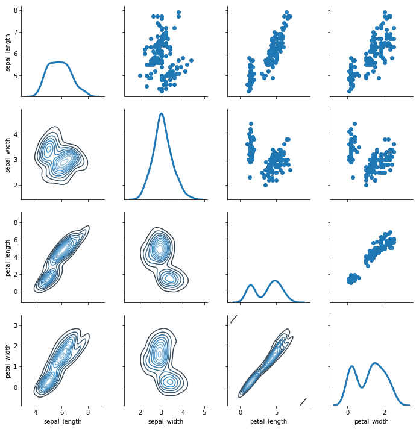


### boxplot
- boxplot은 변수간 또는 범주형 변수의 레벨간 비교를 용이하게 하는 방식으로 양적 데이터의 분포를 보여줌


```python
sns.boxplot(x=tips['total_bill'])
```


    <matplotlib.axes._subplots.AxesSubplot at 0x7f6356a740f0>


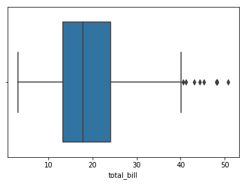


```python
sns.boxplot(x='day', y='total_bill', data=tips)
```


    <matplotlib.axes._subplots.AxesSubplot at 0x7f635692ca58>


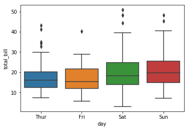


### violinplot
- boxplot과 유사한 역할을 한다.


```python
sns.violinplot(x=tips['total_bill'])
```


    <matplotlib.axes._subplots.AxesSubplot at 0x7f6355cd89e8>


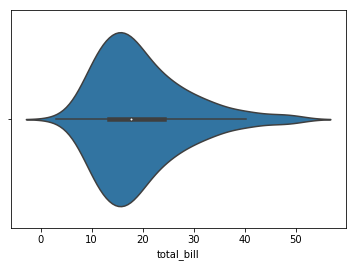


```python
sns.violinplot(x='day', y='total_bill', data=tips)
```


    <matplotlib.axes._subplots.AxesSubplot at 0x7f6355cadc18>


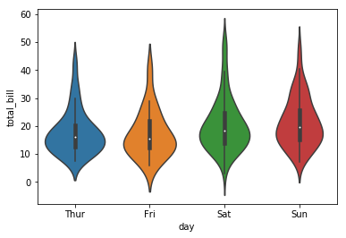


---

## IPA 주관 인공지능센터 기본(fundamental) 과정
- GitHub link: [here](https://github.com/Wind-Kyle/ai-course-fundamentals)
- E-Mail: windkyle7@gmail.com
