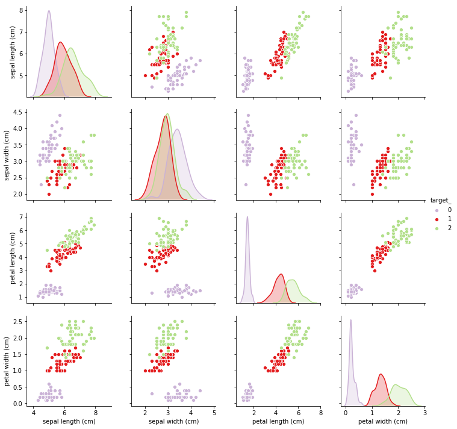
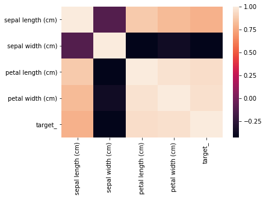

## iris 데이터 학습시키기
이전에는 `seaborn` 모듈에서 제공하는 `iris` 데이터셋을 불러와서 분석을 했었다.
이번에는 `sklearn` 모듈의 `load_iris`를 통해 데이터셋을 불러온다.


```python
import numpy as np
import pandas as pd
import seaborn as sns
```

먼저, `sklearn.datasets`의 `load_iris`를 임포트한다.


```python
from sklearn.datasets import load_iris
dataset = load_iris()
```

불러온 학습셋과 정답셋을 각각 `DataFrame`으로 만든 후, `concat`으로 합쳐본다.


```python
data = pd.DataFrame(dataset.data, columns=dataset.feature_names)
target = pd.DataFrame(dataset.target, columns=['target_'])
iris = pd.concat([data, target], axis=1)
```

학습 시 필요한 데이터는 숫자 데이터, 그 중에서도 정수형이기 때문에 아래와 같이 데이터의 타입을 `int` 타입으로 바꿔준다.


```python
iris.target_ = iris.target_.astype('int')
```

데이터의 정보를 확인해본다.


```python
iris.info()
```

    <class 'pandas.core.frame.DataFrame'>
    RangeIndex: 150 entries, 0 to 149
    Data columns (total 5 columns):
    sepal length (cm)    150 non-null float64
    sepal width (cm)     150 non-null float64
    petal length (cm)    150 non-null float64
    petal width (cm)     150 non-null float64
    target_              150 non-null int64
    dtypes: float64(4), int64(1)
    memory usage: 5.9 KB


`corr`를 통해 상관관계를 확인해보면 아래와 같다.


```python
iris.corr()
```


<div>
<style scoped>
    .dataframe tbody tr th:only-of-type {
        vertical-align: middle;
    }

    .dataframe tbody tr th {
        vertical-align: top;
    }

    .dataframe thead th {
        text-align: right;
    }
</style>
<table border="1" class="dataframe">
  <thead>
    <tr style="text-align: right;">
      <th></th>
      <th>sepal length (cm)</th>
      <th>sepal width (cm)</th>
      <th>petal length (cm)</th>
      <th>petal width (cm)</th>
      <th>target_</th>
    </tr>
  </thead>
  <tbody>
    <tr>
      <th>sepal length (cm)</th>
      <td>1.000000</td>
      <td>-0.117570</td>
      <td>0.871754</td>
      <td>0.817941</td>
      <td>0.782561</td>
    </tr>
    <tr>
      <th>sepal width (cm)</th>
      <td>-0.117570</td>
      <td>1.000000</td>
      <td>-0.428440</td>
      <td>-0.366126</td>
      <td>-0.426658</td>
    </tr>
    <tr>
      <th>petal length (cm)</th>
      <td>0.871754</td>
      <td>-0.428440</td>
      <td>1.000000</td>
      <td>0.962865</td>
      <td>0.949035</td>
    </tr>
    <tr>
      <th>petal width (cm)</th>
      <td>0.817941</td>
      <td>-0.366126</td>
      <td>0.962865</td>
      <td>1.000000</td>
      <td>0.956547</td>
    </tr>
    <tr>
      <th>target_</th>
      <td>0.782561</td>
      <td>-0.426658</td>
      <td>0.949035</td>
      <td>0.956547</td>
      <td>1.000000</td>
    </tr>
  </tbody>
</table>
</div>


`pairplot`으로 시각화도 해본다.


```python
sns.pairplot(iris, vars=iris.columns[:-1], palette='Paired_r', hue='target_')
```


    <seaborn.axisgrid.PairGrid at 0x7fc34ee401d0>





상관관계에 대한 `heatmap` 역시 그릴 수 있다.


```python
sns.heatmap(iris.corr())
```


    <matplotlib.axes._subplots.AxesSubplot at 0x7fc311df8be0>





## Scikit-Learn
그동한 데이터를 분석했던 것을 토대로 기계학습을 시도해본다. `scikit-learn`을 처음으로 맛보기를 해보고자 한다.

먼저, `neighbors` 알고리즘 중 그 유명한 `KNN` 모델을 사용해 데이터를 분류해본다. 아래와 같이 코드를 작성한다.


```python
from sklearn.neighbors import KNeighborsClassifier
knn = KNeighborsClassifier()
```

`scikit-learn`은 추상화가 잘되어있는 모듈이다. 모델을 사용하는 모든 방법들은 하나의 방법으로 귀결되는데, 먼저 모듈을 인스턴스화한 후 `fit` 메소드를 통해 데이터를 학습시킨 후 `predict` 메소드로 예측을 시도한다.


```python
knn.fit(iris.iloc[:, :-1], iris.iloc[:, -1])
```


    KNeighborsClassifier(algorithm='auto', leaf_size=30, metric='minkowski',
               metric_params=None, n_jobs=None, n_neighbors=5, p=2,
               weights='uniform')


`fit`를 하면 학습이 완료된 모델을 반환한다. 학습이 완료된 모델에 적용된 여러 파라미터들은 `하이퍼 파라미터(Hyper-Parameter)`라고 한다. 하이퍼 파라미터에 대한 자세한 설명은 뒷장에서 다루고자 한다.


```python
knn.predict([[3, 3, 3, 3]])
```


    array([1])


위의 `predict` 메소드를 통해 나온 예측 결과는 `target`의 인덱스 번호에 해당한다.


```python
dataset.target_names
```


    array(['setosa', 'versicolor', 'virginica'], dtype='<U10')


즉, 학습시킨 모델에 `3, 3, 3, 3` 이라는 데이터를 예측시켰을 때 `versicolor`로 예측했다는 의미이다.

마찬가지로 `결정 트리(Decision Tree)` 모델을 사용하여 분류를 해본다. 사용 방법은 위와 동일하게 먼저 모델을 인스턴스화 시킨 후 `fit` 한 다음 `predict`로 예측을 시도한다.


```python
from sklearn.tree import DecisionTreeClassifier

tree = DecisionTreeClassifier()
tree.fit(iris.iloc[:, :-1], iris.iloc[:, -1])
```


    DecisionTreeClassifier(class_weight=None, criterion='gini', max_depth=None,
                max_features=None, max_leaf_nodes=None,
                min_impurity_decrease=0.0, min_impurity_split=None,
                min_samples_leaf=1, min_samples_split=2,
                min_weight_fraction_leaf=0.0, presort=False, random_state=None,
                splitter='best')


```python
tree.predict([[3, 3, 3, 3]])
```


    array([1])


여기까지 `scikit-learn` 맛보기를 해보았다. 다음 장에서는 `scikit-learn`에서 제공하는 여러 모델들과 데이터를 분류하는 여러 방법들을 소개하고자 한다.

---

## IPA 주관 인공지능센터 기본(fundamental) 과정
- GitHub link: [here](https://github.com/Wind-Kyle/ai-course-fundamentals)
- E-Mail: windkyle7@gmail.com
