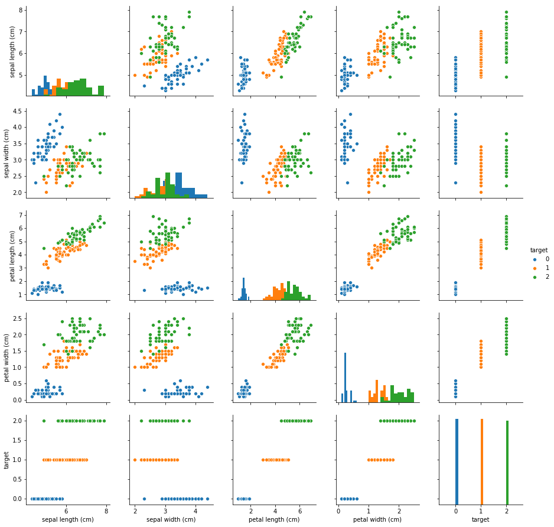
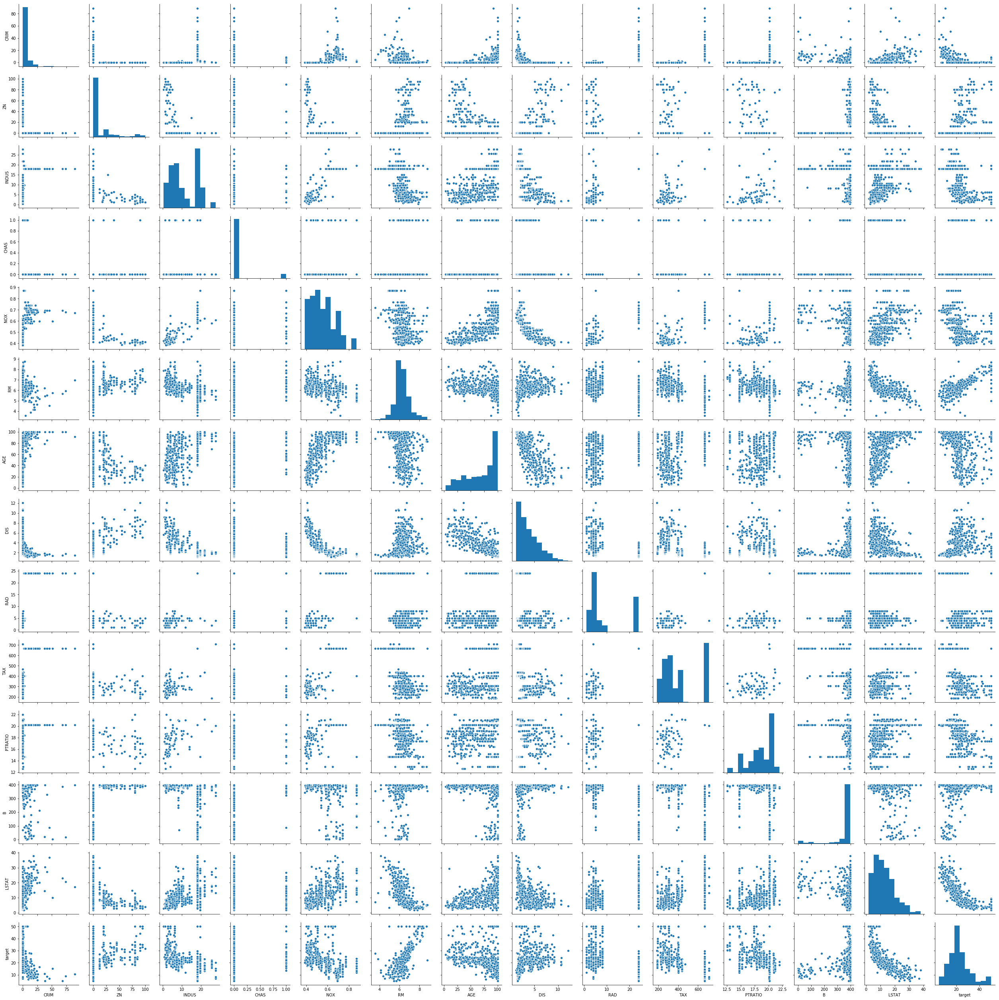
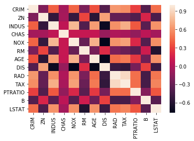

## What is Scikit-Learn?
- 공식 홈페이지: https://scikit-learn.org/
- Simple and efficient tools for data mining and data analysis
- Accessible to everybody, and reusable in various contexts
- Built on NumPy, SciPy, and matplotlib
- Open source, commercially usable - BSD license


```python
import numpy as np
import pandas as pd
import matplotlib as mpl
import matplotlib.pyplot as plt
import seaborn as sns
import missingno as mino
```

## tidy-data: iris 불러오기
seaborn을 통해 불러올 때 다음과 같이 불러왔다.


```python
iris_seaborn = sns.load_dataset('iris')
iris_seaborn.sample(5)
```


<div>
<style scoped>
    .dataframe tbody tr th:only-of-type {
        vertical-align: middle;
    }

    .dataframe tbody tr th {
        vertical-align: top;
    }

    .dataframe thead th {
        text-align: right;
    }
</style>
<table border="1" class="dataframe">
  <thead>
    <tr style="text-align: right;">
      <th></th>
      <th>sepal_length</th>
      <th>sepal_width</th>
      <th>petal_length</th>
      <th>petal_width</th>
      <th>species</th>
    </tr>
  </thead>
  <tbody>
    <tr>
      <th>21</th>
      <td>5.1</td>
      <td>3.7</td>
      <td>1.5</td>
      <td>0.4</td>
      <td>setosa</td>
    </tr>
    <tr>
      <th>139</th>
      <td>6.9</td>
      <td>3.1</td>
      <td>5.4</td>
      <td>2.1</td>
      <td>virginica</td>
    </tr>
    <tr>
      <th>26</th>
      <td>5.0</td>
      <td>3.4</td>
      <td>1.6</td>
      <td>0.4</td>
      <td>setosa</td>
    </tr>
    <tr>
      <th>59</th>
      <td>5.2</td>
      <td>2.7</td>
      <td>3.9</td>
      <td>1.4</td>
      <td>versicolor</td>
    </tr>
    <tr>
      <th>140</th>
      <td>6.7</td>
      <td>3.1</td>
      <td>5.6</td>
      <td>2.4</td>
      <td>virginica</td>
    </tr>
  </tbody>
</table>
</div>


## sklearn을 통해 tidy-data 불러오기
`scikit-learn` 패키지가 없을 경우 아래의 명령어를 주피터 셀에 입력해준다.
```dos
%pip install --upgrade sklearn
```


```python
from sklearn.datasets import load_iris
iris_dataset = load_iris()
```

불러온 데이터셋을 `dir`로 살펴보면 아래와 같다.


```python
dir(iris_dataset)
```


    ['DESCR', 'data', 'feature_names', 'filename', 'target', 'target_names']


`scikit-learn`을 통해 불러온 데이터셋에 대한 설명을 볼 때는 `DESCR`를 통해 볼 수 있다.


```python
print(iris_dataset.DESCR)
```

    .. _iris_dataset:
    
    Iris plants dataset
    --------------------
    
    **Data Set Characteristics:**
    
        :Number of Instances: 150 (50 in each of three classes)
        :Number of Attributes: 4 numeric, predictive attributes and the class
        :Attribute Information:
            - sepal length in cm
            - sepal width in cm
            - petal length in cm
            - petal width in cm
            - class:
                    - Iris-Setosa
                    - Iris-Versicolour
                    - Iris-Virginica
                    
        :Summary Statistics:
    
        ============== ==== ==== ======= ===== ====================
                        Min  Max   Mean    SD   Class Correlation
        ============== ==== ==== ======= ===== ====================
        sepal length:   4.3  7.9   5.84   0.83    0.7826
        sepal width:    2.0  4.4   3.05   0.43   -0.4194
        petal length:   1.0  6.9   3.76   1.76    0.9490  (high!)
        petal width:    0.1  2.5   1.20   0.76    0.9565  (high!)
        ============== ==== ==== ======= ===== ====================
    
        :Missing Attribute Values: None
        :Class Distribution: 33.3% for each of 3 classes.
        :Creator: R.A. Fisher
        :Donor: Michael Marshall (MARSHALL%PLU@io.arc.nasa.gov)
        :Date: July, 1988
    
    The famous Iris database, first used by Sir R.A. Fisher. The dataset is taken
    from Fisher's paper. Note that it's the same as in R, but not as in the UCI
    Machine Learning Repository, which has two wrong data points.
    
    This is perhaps the best known database to be found in the
    pattern recognition literature.  Fisher's paper is a classic in the field and
    is referenced frequently to this day.  (See Duda & Hart, for example.)  The
    data set contains 3 classes of 50 instances each, where each class refers to a
    type of iris plant.  One class is linearly separable from the other 2; the
    latter are NOT linearly separable from each other.
    
    .. topic:: References
    
       - Fisher, R.A. "The use of multiple measurements in taxonomic problems"
         Annual Eugenics, 7, Part II, 179-188 (1936); also in "Contributions to
         Mathematical Statistics" (John Wiley, NY, 1950).
       - Duda, R.O., & Hart, P.E. (1973) Pattern Classification and Scene Analysis.
         (Q327.D83) John Wiley & Sons.  ISBN 0-471-22361-1.  See page 218.
       - Dasarathy, B.V. (1980) "Nosing Around the Neighborhood: A New System
         Structure and Classification Rule for Recognition in Partially Exposed
         Environments".  IEEE Transactions on Pattern Analysis and Machine
         Intelligence, Vol. PAMI-2, No. 1, 67-71.
       - Gates, G.W. (1972) "The Reduced Nearest Neighbor Rule".  IEEE Transactions
         on Information Theory, May 1972, 431-433.
       - See also: 1988 MLC Proceedings, 54-64.  Cheeseman et al"s AUTOCLASS II
         conceptual clustering system finds 3 classes in the data.
       - Many, many more ...


학습에 필요한 학습 데이터셋과 정답셋을 `DataFrame`으로 바꿔준다.


```python
iris_data = pd.DataFrame(iris_dataset.data, columns=iris_dataset.feature_names)
iris_target = pd.DataFrame(iris_dataset.target, columns=['target'])
```


```python
iris_data.info()
iris_data.sample(5)
```

    <class 'pandas.core.frame.DataFrame'>
    RangeIndex: 150 entries, 0 to 149
    Data columns (total 4 columns):
    sepal length (cm)    150 non-null float64
    sepal width (cm)     150 non-null float64
    petal length (cm)    150 non-null float64
    petal width (cm)     150 non-null float64
    dtypes: float64(4)
    memory usage: 4.8 KB


<div>
<style scoped>
    .dataframe tbody tr th:only-of-type {
        vertical-align: middle;
    }

    .dataframe tbody tr th {
        vertical-align: top;
    }

    .dataframe thead th {
        text-align: right;
    }
</style>
<table border="1" class="dataframe">
  <thead>
    <tr style="text-align: right;">
      <th></th>
      <th>sepal length (cm)</th>
      <th>sepal width (cm)</th>
      <th>petal length (cm)</th>
      <th>petal width (cm)</th>
    </tr>
  </thead>
  <tbody>
    <tr>
      <th>128</th>
      <td>6.4</td>
      <td>2.8</td>
      <td>5.6</td>
      <td>2.1</td>
    </tr>
    <tr>
      <th>73</th>
      <td>6.1</td>
      <td>2.8</td>
      <td>4.7</td>
      <td>1.2</td>
    </tr>
    <tr>
      <th>0</th>
      <td>5.1</td>
      <td>3.5</td>
      <td>1.4</td>
      <td>0.2</td>
    </tr>
    <tr>
      <th>70</th>
      <td>5.9</td>
      <td>3.2</td>
      <td>4.8</td>
      <td>1.8</td>
    </tr>
    <tr>
      <th>57</th>
      <td>4.9</td>
      <td>2.4</td>
      <td>3.3</td>
      <td>1.0</td>
    </tr>
  </tbody>
</table>
</div>


```python
iris_target.info()
iris_target.sample(5)
```

    <class 'pandas.core.frame.DataFrame'>
    RangeIndex: 150 entries, 0 to 149
    Data columns (total 1 columns):
    target    150 non-null int64
    dtypes: int64(1)
    memory usage: 1.2 KB


<div>
<style scoped>
    .dataframe tbody tr th:only-of-type {
        vertical-align: middle;
    }

    .dataframe tbody tr th {
        vertical-align: top;
    }

    .dataframe thead th {
        text-align: right;
    }
</style>
<table border="1" class="dataframe">
  <thead>
    <tr style="text-align: right;">
      <th></th>
      <th>target</th>
    </tr>
  </thead>
  <tbody>
    <tr>
      <th>146</th>
      <td>2</td>
    </tr>
    <tr>
      <th>55</th>
      <td>1</td>
    </tr>
    <tr>
      <th>112</th>
      <td>2</td>
    </tr>
    <tr>
      <th>92</th>
      <td>1</td>
    </tr>
    <tr>
      <th>70</th>
      <td>1</td>
    </tr>
  </tbody>
</table>
</div>


`concat`으로 데이터들을 합쳐준다.


```python
iris = pd.concat([iris_data, iris_target], axis=1)
```

학습을 시키기 전에 `Visualization` 해본다.
- 아래의 그래프를 보면 데이터들을 classfication 할 수 있다는 것을 알 수 있다.
- classfication이 가능하다는 것은 곧 기계학습을 할 수 있다는 것을 확인할 수 있다.


```python
iris['target'] = iris['target'].astype('category')
```


```python
sns.pairplot(iris, diag_kind='hist', hue='target')
```


    <seaborn.axisgrid.PairGrid at 0x7fc070359470>


### iloc로 가져오기


```python
sns.pairplot(iris.iloc[:-1], diag_kind='hist', hue='target')
```


    <seaborn.axisgrid.PairGrid at 0x7fc038e344a8>





```python
sns.pairplot(iris, vars=iris.iloc[:-1], diag_kind='hist', hue='target')
```


    <seaborn.axisgrid.PairGrid at 0x7fc0325ca320>


## tidy-data: boston 가져오기


```python
from sklearn.datasets import load_boston
```


```python
boston_dataset = load_boston()
boston_data = pd.DataFrame(boston_dataset.data,
                           columns=boston_dataset.feature_names)
boston_target = pd.DataFrame(boston_dataset.target, columns=['target'])
```


```python
boston_data.info()
boston_data.sample(5)
```

    <class 'pandas.core.frame.DataFrame'>
    RangeIndex: 506 entries, 0 to 505
    Data columns (total 13 columns):
    CRIM       506 non-null float64
    ZN         506 non-null float64
    INDUS      506 non-null float64
    CHAS       506 non-null float64
    NOX        506 non-null float64
    RM         506 non-null float64
    AGE        506 non-null float64
    DIS        506 non-null float64
    RAD        506 non-null float64
    TAX        506 non-null float64
    PTRATIO    506 non-null float64
    B          506 non-null float64
    LSTAT      506 non-null float64
    dtypes: float64(13)
    memory usage: 51.5 KB


<div>
<style scoped>
    .dataframe tbody tr th:only-of-type {
        vertical-align: middle;
    }

    .dataframe tbody tr th {
        vertical-align: top;
    }

    .dataframe thead th {
        text-align: right;
    }
</style>
<table border="1" class="dataframe">
  <thead>
    <tr style="text-align: right;">
      <th></th>
      <th>CRIM</th>
      <th>ZN</th>
      <th>INDUS</th>
      <th>CHAS</th>
      <th>NOX</th>
      <th>RM</th>
      <th>AGE</th>
      <th>DIS</th>
      <th>RAD</th>
      <th>TAX</th>
      <th>PTRATIO</th>
      <th>B</th>
      <th>LSTAT</th>
    </tr>
  </thead>
  <tbody>
    <tr>
      <th>171</th>
      <td>2.31390</td>
      <td>0.0</td>
      <td>19.58</td>
      <td>0.0</td>
      <td>0.605</td>
      <td>5.880</td>
      <td>97.3</td>
      <td>2.3887</td>
      <td>5.0</td>
      <td>403.0</td>
      <td>14.7</td>
      <td>348.13</td>
      <td>12.03</td>
    </tr>
    <tr>
      <th>322</th>
      <td>0.35114</td>
      <td>0.0</td>
      <td>7.38</td>
      <td>0.0</td>
      <td>0.493</td>
      <td>6.041</td>
      <td>49.9</td>
      <td>4.7211</td>
      <td>5.0</td>
      <td>287.0</td>
      <td>19.6</td>
      <td>396.90</td>
      <td>7.70</td>
    </tr>
    <tr>
      <th>379</th>
      <td>17.86670</td>
      <td>0.0</td>
      <td>18.10</td>
      <td>0.0</td>
      <td>0.671</td>
      <td>6.223</td>
      <td>100.0</td>
      <td>1.3861</td>
      <td>24.0</td>
      <td>666.0</td>
      <td>20.2</td>
      <td>393.74</td>
      <td>21.78</td>
    </tr>
    <tr>
      <th>483</th>
      <td>2.81838</td>
      <td>0.0</td>
      <td>18.10</td>
      <td>0.0</td>
      <td>0.532</td>
      <td>5.762</td>
      <td>40.3</td>
      <td>4.0983</td>
      <td>24.0</td>
      <td>666.0</td>
      <td>20.2</td>
      <td>392.92</td>
      <td>10.42</td>
    </tr>
    <tr>
      <th>333</th>
      <td>0.05083</td>
      <td>0.0</td>
      <td>5.19</td>
      <td>0.0</td>
      <td>0.515</td>
      <td>6.316</td>
      <td>38.1</td>
      <td>6.4584</td>
      <td>5.0</td>
      <td>224.0</td>
      <td>20.2</td>
      <td>389.71</td>
      <td>5.68</td>
    </tr>
  </tbody>
</table>
</div>


```python
boston_target.info()
boston_target.sample(5)
```

    <class 'pandas.core.frame.DataFrame'>
    RangeIndex: 506 entries, 0 to 505
    Data columns (total 1 columns):
    target    506 non-null float64
    dtypes: float64(1)
    memory usage: 4.0 KB


<div>
<style scoped>
    .dataframe tbody tr th:only-of-type {
        vertical-align: middle;
    }

    .dataframe tbody tr th {
        vertical-align: top;
    }

    .dataframe thead th {
        text-align: right;
    }
</style>
<table border="1" class="dataframe">
  <thead>
    <tr style="text-align: right;">
      <th></th>
      <th>target</th>
    </tr>
  </thead>
  <tbody>
    <tr>
      <th>125</th>
      <td>21.4</td>
    </tr>
    <tr>
      <th>204</th>
      <td>50.0</td>
    </tr>
    <tr>
      <th>0</th>
      <td>24.0</td>
    </tr>
    <tr>
      <th>360</th>
      <td>25.0</td>
    </tr>
    <tr>
      <th>235</th>
      <td>24.0</td>
    </tr>
  </tbody>
</table>
</div>


```python
boston_target['target'] = boston_target['target'].astype('category')
```


```python
boston = pd.concat([boston_data, boston_target], axis=1)
boston.info()
boston.sample(5)
```

    <class 'pandas.core.frame.DataFrame'>
    RangeIndex: 506 entries, 0 to 505
    Data columns (total 14 columns):
    CRIM       506 non-null float64
    ZN         506 non-null float64
    INDUS      506 non-null float64
    CHAS       506 non-null float64
    NOX        506 non-null float64
    RM         506 non-null float64
    AGE        506 non-null float64
    DIS        506 non-null float64
    RAD        506 non-null float64
    TAX        506 non-null float64
    PTRATIO    506 non-null float64
    B          506 non-null float64
    LSTAT      506 non-null float64
    target     506 non-null category
    dtypes: category(1), float64(13)
    memory usage: 64.2 KB


<div>
<style scoped>
    .dataframe tbody tr th:only-of-type {
        vertical-align: middle;
    }

    .dataframe tbody tr th {
        vertical-align: top;
    }

    .dataframe thead th {
        text-align: right;
    }
</style>
<table border="1" class="dataframe">
  <thead>
    <tr style="text-align: right;">
      <th></th>
      <th>CRIM</th>
      <th>ZN</th>
      <th>INDUS</th>
      <th>CHAS</th>
      <th>NOX</th>
      <th>RM</th>
      <th>AGE</th>
      <th>DIS</th>
      <th>RAD</th>
      <th>TAX</th>
      <th>PTRATIO</th>
      <th>B</th>
      <th>LSTAT</th>
      <th>target</th>
    </tr>
  </thead>
  <tbody>
    <tr>
      <th>188</th>
      <td>0.12579</td>
      <td>45.0</td>
      <td>3.44</td>
      <td>0.0</td>
      <td>0.437</td>
      <td>6.556</td>
      <td>29.1</td>
      <td>4.5667</td>
      <td>5.0</td>
      <td>398.0</td>
      <td>15.2</td>
      <td>382.84</td>
      <td>4.56</td>
      <td>29.8</td>
    </tr>
    <tr>
      <th>234</th>
      <td>0.44791</td>
      <td>0.0</td>
      <td>6.20</td>
      <td>1.0</td>
      <td>0.507</td>
      <td>6.726</td>
      <td>66.5</td>
      <td>3.6519</td>
      <td>8.0</td>
      <td>307.0</td>
      <td>17.4</td>
      <td>360.20</td>
      <td>8.05</td>
      <td>29.0</td>
    </tr>
    <tr>
      <th>65</th>
      <td>0.03584</td>
      <td>80.0</td>
      <td>3.37</td>
      <td>0.0</td>
      <td>0.398</td>
      <td>6.290</td>
      <td>17.8</td>
      <td>6.6115</td>
      <td>4.0</td>
      <td>337.0</td>
      <td>16.1</td>
      <td>396.90</td>
      <td>4.67</td>
      <td>23.5</td>
    </tr>
    <tr>
      <th>271</th>
      <td>0.16211</td>
      <td>20.0</td>
      <td>6.96</td>
      <td>0.0</td>
      <td>0.464</td>
      <td>6.240</td>
      <td>16.3</td>
      <td>4.4290</td>
      <td>3.0</td>
      <td>223.0</td>
      <td>18.6</td>
      <td>396.90</td>
      <td>6.59</td>
      <td>25.2</td>
    </tr>
    <tr>
      <th>412</th>
      <td>18.81100</td>
      <td>0.0</td>
      <td>18.10</td>
      <td>0.0</td>
      <td>0.597</td>
      <td>4.628</td>
      <td>100.0</td>
      <td>1.5539</td>
      <td>24.0</td>
      <td>666.0</td>
      <td>20.2</td>
      <td>28.79</td>
      <td>34.37</td>
      <td>17.9</td>
    </tr>
  </tbody>
</table>
</div>


### Visualization


```python
sns.pairplot(boston)
```


    <seaborn.axisgrid.PairGrid at 0x7fc03149bf60>





### 상관관계 확인


```python
boston.corr()
```


<div>
<style scoped>
    .dataframe tbody tr th:only-of-type {
        vertical-align: middle;
    }

    .dataframe tbody tr th {
        vertical-align: top;
    }

    .dataframe thead th {
        text-align: right;
    }
</style>
<table border="1" class="dataframe">
  <thead>
    <tr style="text-align: right;">
      <th></th>
      <th>CRIM</th>
      <th>ZN</th>
      <th>INDUS</th>
      <th>CHAS</th>
      <th>NOX</th>
      <th>RM</th>
      <th>AGE</th>
      <th>DIS</th>
      <th>RAD</th>
      <th>TAX</th>
      <th>PTRATIO</th>
      <th>B</th>
      <th>LSTAT</th>
    </tr>
  </thead>
  <tbody>
    <tr>
      <th>CRIM</th>
      <td>1.000000</td>
      <td>-0.200469</td>
      <td>0.406583</td>
      <td>-0.055892</td>
      <td>0.420972</td>
      <td>-0.219247</td>
      <td>0.352734</td>
      <td>-0.379670</td>
      <td>0.625505</td>
      <td>0.582764</td>
      <td>0.289946</td>
      <td>-0.385064</td>
      <td>0.455621</td>
    </tr>
    <tr>
      <th>ZN</th>
      <td>-0.200469</td>
      <td>1.000000</td>
      <td>-0.533828</td>
      <td>-0.042697</td>
      <td>-0.516604</td>
      <td>0.311991</td>
      <td>-0.569537</td>
      <td>0.664408</td>
      <td>-0.311948</td>
      <td>-0.314563</td>
      <td>-0.391679</td>
      <td>0.175520</td>
      <td>-0.412995</td>
    </tr>
    <tr>
      <th>INDUS</th>
      <td>0.406583</td>
      <td>-0.533828</td>
      <td>1.000000</td>
      <td>0.062938</td>
      <td>0.763651</td>
      <td>-0.391676</td>
      <td>0.644779</td>
      <td>-0.708027</td>
      <td>0.595129</td>
      <td>0.720760</td>
      <td>0.383248</td>
      <td>-0.356977</td>
      <td>0.603800</td>
    </tr>
    <tr>
      <th>CHAS</th>
      <td>-0.055892</td>
      <td>-0.042697</td>
      <td>0.062938</td>
      <td>1.000000</td>
      <td>0.091203</td>
      <td>0.091251</td>
      <td>0.086518</td>
      <td>-0.099176</td>
      <td>-0.007368</td>
      <td>-0.035587</td>
      <td>-0.121515</td>
      <td>0.048788</td>
      <td>-0.053929</td>
    </tr>
    <tr>
      <th>NOX</th>
      <td>0.420972</td>
      <td>-0.516604</td>
      <td>0.763651</td>
      <td>0.091203</td>
      <td>1.000000</td>
      <td>-0.302188</td>
      <td>0.731470</td>
      <td>-0.769230</td>
      <td>0.611441</td>
      <td>0.668023</td>
      <td>0.188933</td>
      <td>-0.380051</td>
      <td>0.590879</td>
    </tr>
    <tr>
      <th>RM</th>
      <td>-0.219247</td>
      <td>0.311991</td>
      <td>-0.391676</td>
      <td>0.091251</td>
      <td>-0.302188</td>
      <td>1.000000</td>
      <td>-0.240265</td>
      <td>0.205246</td>
      <td>-0.209847</td>
      <td>-0.292048</td>
      <td>-0.355501</td>
      <td>0.128069</td>
      <td>-0.613808</td>
    </tr>
    <tr>
      <th>AGE</th>
      <td>0.352734</td>
      <td>-0.569537</td>
      <td>0.644779</td>
      <td>0.086518</td>
      <td>0.731470</td>
      <td>-0.240265</td>
      <td>1.000000</td>
      <td>-0.747881</td>
      <td>0.456022</td>
      <td>0.506456</td>
      <td>0.261515</td>
      <td>-0.273534</td>
      <td>0.602339</td>
    </tr>
    <tr>
      <th>DIS</th>
      <td>-0.379670</td>
      <td>0.664408</td>
      <td>-0.708027</td>
      <td>-0.099176</td>
      <td>-0.769230</td>
      <td>0.205246</td>
      <td>-0.747881</td>
      <td>1.000000</td>
      <td>-0.494588</td>
      <td>-0.534432</td>
      <td>-0.232471</td>
      <td>0.291512</td>
      <td>-0.496996</td>
    </tr>
    <tr>
      <th>RAD</th>
      <td>0.625505</td>
      <td>-0.311948</td>
      <td>0.595129</td>
      <td>-0.007368</td>
      <td>0.611441</td>
      <td>-0.209847</td>
      <td>0.456022</td>
      <td>-0.494588</td>
      <td>1.000000</td>
      <td>0.910228</td>
      <td>0.464741</td>
      <td>-0.444413</td>
      <td>0.488676</td>
    </tr>
    <tr>
      <th>TAX</th>
      <td>0.582764</td>
      <td>-0.314563</td>
      <td>0.720760</td>
      <td>-0.035587</td>
      <td>0.668023</td>
      <td>-0.292048</td>
      <td>0.506456</td>
      <td>-0.534432</td>
      <td>0.910228</td>
      <td>1.000000</td>
      <td>0.460853</td>
      <td>-0.441808</td>
      <td>0.543993</td>
    </tr>
    <tr>
      <th>PTRATIO</th>
      <td>0.289946</td>
      <td>-0.391679</td>
      <td>0.383248</td>
      <td>-0.121515</td>
      <td>0.188933</td>
      <td>-0.355501</td>
      <td>0.261515</td>
      <td>-0.232471</td>
      <td>0.464741</td>
      <td>0.460853</td>
      <td>1.000000</td>
      <td>-0.177383</td>
      <td>0.374044</td>
    </tr>
    <tr>
      <th>B</th>
      <td>-0.385064</td>
      <td>0.175520</td>
      <td>-0.356977</td>
      <td>0.048788</td>
      <td>-0.380051</td>
      <td>0.128069</td>
      <td>-0.273534</td>
      <td>0.291512</td>
      <td>-0.444413</td>
      <td>-0.441808</td>
      <td>-0.177383</td>
      <td>1.000000</td>
      <td>-0.366087</td>
    </tr>
    <tr>
      <th>LSTAT</th>
      <td>0.455621</td>
      <td>-0.412995</td>
      <td>0.603800</td>
      <td>-0.053929</td>
      <td>0.590879</td>
      <td>-0.613808</td>
      <td>0.602339</td>
      <td>-0.496996</td>
      <td>0.488676</td>
      <td>0.543993</td>
      <td>0.374044</td>
      <td>-0.366087</td>
      <td>1.000000</td>
    </tr>
  </tbody>
</table>
</div>


```python
sns.heatmap(boston.corr())
```


    <matplotlib.axes._subplots.AxesSubplot at 0x7fc02b683cf8>





## 학습 시키기


```python
from sklearn.neighbors import KNeighborsClassifier
```

### Hyper Parameter
- 신경망 학습을 통해서 튜닝 또는 최적화 해야하는 주변수가 아니라 학습 진도율이나 일반화 변수처럼 사람들이 선험적 지식으로 설정을 하거나 외부 모델 메커니즘을 통해 자동으로 설정이 되는 변수를 의미한다.

`KNN` 모델에 적용되는 파라미터는 `Hyper Parameter`이다.


```python
knn = KNeighborsClassifier()
```

`fit` 메소드를 호출할 때, `X`에는 학습 데이터셋, `y`에는 정답셋을 넣어준다.


```python
knn.fit(iris.iloc[:, :-1], iris.iloc[:, -1])
```


    KNeighborsClassifier(algorithm='auto', leaf_size=30, metric='minkowski',
               metric_params=None, n_jobs=None, n_neighbors=5, p=2,
               weights='uniform')


`predict`를 통해 예측을 시도한다.


```python
pred = knn.predict([[3, 3, 3, 3]])
```

예측된 결과를 확인해본다.


```python
iris_dataset.target_names[pred]
```


    array(['versicolor'], dtype='<U10')


## boston 데이터로 학습


```python
from sklearn.neighbors import KNeighborsRegressor

knn = KNeighborsRegressor()
knn.fit(boston.iloc[:, :-1], boston.iloc[:, -1])
knn.predict([boston.iloc[2, :-1]])
```


    array([25.36])


```python
boston.iloc[2, -1]
```


    34.7


---

## IPA 주관 인공지능센터 기본(fundamental) 과정
- GitHub link: [here](https://github.com/Wind-Kyle/ai-course-fundamentals)
- E-Mail: windkyle7@gmail.com
