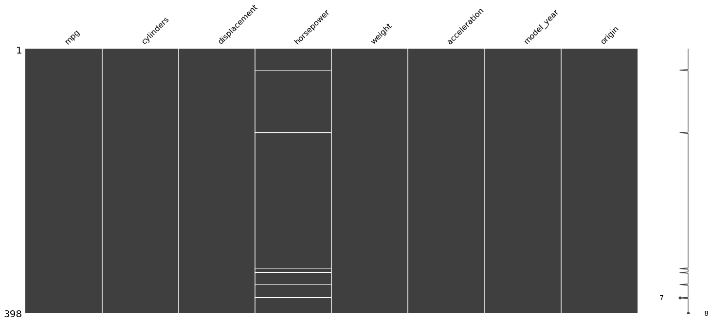
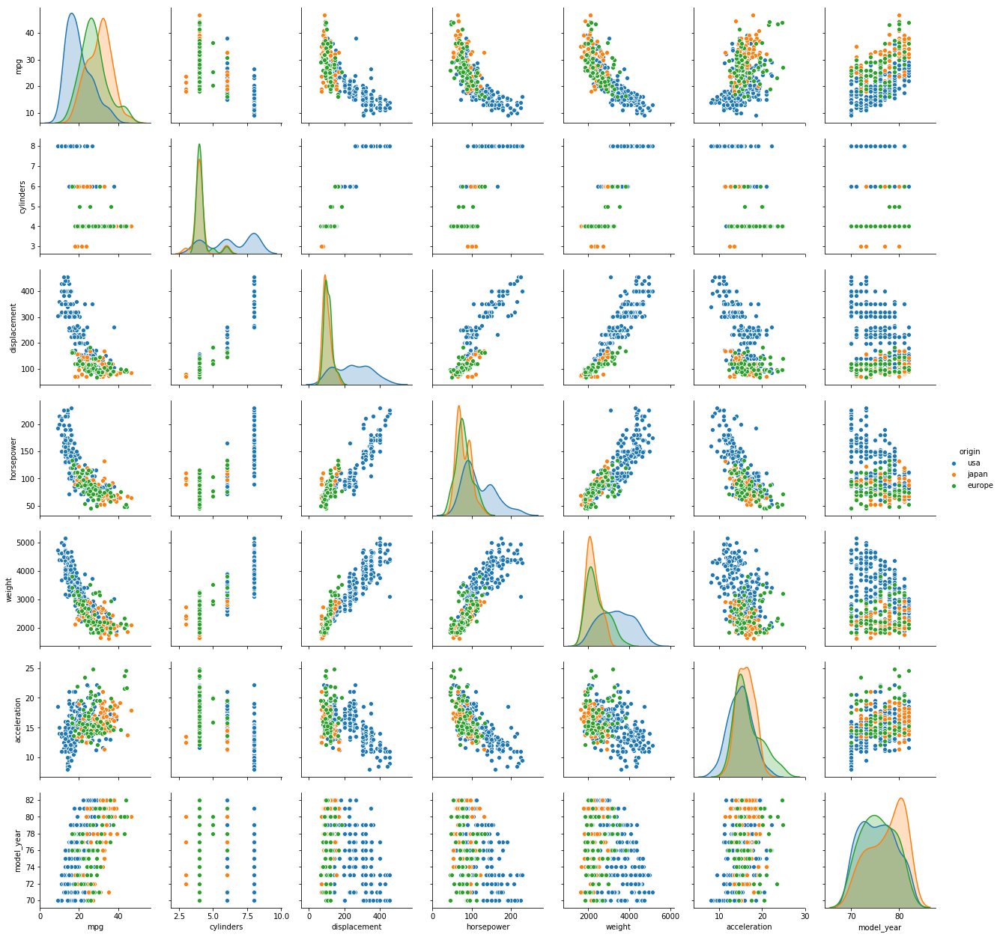

`missing value`가 섞여있는 데이터를 어떻게 처리하고 학습을 시키는지에 대해 알아보고자 한다. 실습에 사용할 데이터는 `seaborn`에서 제공하는 `mpg` 데이터셋을 사용하고자 한다.


```python
import pandas as pd
import seaborn as sns
```

여기서 학습에 필요한 데이터만 따로 빼놓는다.


```python
mpg = sns.load_dataset('mpg')
mpg = mpg.iloc[:, :-1]
```

`info`를 통해 확인해보면 `horsepower` 컬럼에 `missing value`가 있는 것을 확인할 수 있다.


```python
mpg.info()
```

    <class 'pandas.core.frame.DataFrame'>
    RangeIndex: 398 entries, 0 to 397
    Data columns (total 8 columns):
    mpg             398 non-null float64
    cylinders       398 non-null int64
    displacement    398 non-null float64
    horsepower      392 non-null float64
    weight          398 non-null int64
    acceleration    398 non-null float64
    model_year      398 non-null int64
    origin          398 non-null object
    dtypes: float64(4), int64(3), object(1)
    memory usage: 25.0+ KB


`missingno` 모듈을 통해 `missing value`를 시각화하여 살펴볼 수 있다.


```python
import missingno as mino
mino.matrix(mpg)
```


    <matplotlib.axes._subplots.AxesSubplot at 0x7fd066867550>





위에서 살펴본 바와 같이 `missing value`가 있다는 것을 확인했다. 첫번재 방법은 가장 단순하게 `dropna`를 통해 `missing value`가 있는 row 데이터를 날린다.


```python
mpg.dropna(inplace=True)
```


```python
mpg.info()
```

    <class 'pandas.core.frame.DataFrame'>
    Int64Index: 392 entries, 0 to 397
    Data columns (total 8 columns):
    mpg             392 non-null float64
    cylinders       392 non-null int64
    displacement    392 non-null float64
    horsepower      392 non-null float64
    weight          392 non-null int64
    acceleration    392 non-null float64
    model_year      392 non-null int64
    origin          392 non-null object
    dtypes: float64(4), int64(3), object(1)
    memory usage: 27.6+ KB


학습에 적합한 데이터인지 그래프를 그려 시각화해본다.


```python
sns.pairplot(mpg, hue='origin')
```


    <seaborn.axisgrid.PairGrid at 0x7fd0662960b8>





데이터가 적은 경우, 섣불리 `dropna`를 하게되면 성능이 낮아질 수밖에 없다. 따라서 두번째 방법으로, `fillna`를 사용하여 주변 데이터의 평균 데이터를 `missing value`에 채워넣는 방식이 있다.


```python
mpg = sns.load_dataset('mpg')
mpg = mpg.iloc[:, :-1]
mpg.horsepower = mpg.horsepower.fillna(method='ffill')
```

`missing value`를 기준으로 앞의 데이터들에 대한 평균값으로 채워넣었다.


```python
mpg.info()
```

    <class 'pandas.core.frame.DataFrame'>
    RangeIndex: 398 entries, 0 to 397
    Data columns (total 8 columns):
    mpg             398 non-null float64
    cylinders       398 non-null int64
    displacement    398 non-null float64
    horsepower      398 non-null float64
    weight          398 non-null int64
    acceleration    398 non-null float64
    model_year      398 non-null int64
    origin          398 non-null object
    dtypes: float64(4), int64(3), object(1)
    memory usage: 25.0+ KB


`origin` 컬럼을 target 데이터로써 분류하고자 한다. 그러나 dtype이 `object`라는 것을 확인할 수 있다.


```python
mpg.origin.unique()
```


    array(['usa', 'japan', 'europe'], dtype=object)


기계학습은 숫자 데이터로만 해야하기 때문에 이를 숫자 데이터로 바꾸어준다.


```python
mpg.origin = mpg.origin.map({'usa':0, 'japan':1, 'europe':2})
```


```python
mpg.info()
```

    <class 'pandas.core.frame.DataFrame'>
    RangeIndex: 398 entries, 0 to 397
    Data columns (total 8 columns):
    mpg             398 non-null float64
    cylinders       398 non-null int64
    displacement    398 non-null float64
    horsepower      398 non-null float64
    weight          398 non-null int64
    acceleration    398 non-null float64
    model_year      398 non-null int64
    origin          398 non-null int64
    dtypes: float64(4), int64(4)
    memory usage: 25.0 KB


이제 학습을 시도해본다. 먼저, <b>과적합(Overfitting)</b> 현상을 방지하기 위해 `train_test_split`을 통해 학습에 필요한 데이터와 테스트를 위한 데이터로 분리시켜 학습이 잘 되었는지 `검증(validation)`하고자 한다.
<b>과적합</b>이란, 주어진 학습 데이터셋에 너무 치중되어 학습된 나머지, 주어진 데이터가 주어졌을 경우에는 굉장한 성능을 보이는 반면, 학습할 때 주어지지 않은 데이터가 주어졌을 경우에는 성능이 잘 나오지 않게되는 현상을 의미한다.


```python
from sklearn.model_selection import train_test_split
X_train, X_test, y_train, y_test =\
    train_test_split(mpg.iloc[:, :-1], mpg.iloc[:, -1])
```

성능 평가를 위해 train 데이터셋과 test 데이터셋으로 분리시켰다. 이제 knn 모델을 이용하여 학습을 시도해본다.


```python
from sklearn.neighbors import KNeighborsClassifier

knn = KNeighborsClassifier()
knn.fit(X_train, y_train)
```


    KNeighborsClassifier(algorithm='auto', leaf_size=30, metric='minkowski',
               metric_params=None, n_jobs=None, n_neighbors=5, p=2,
               weights='uniform')


test 데이터가 주어졌을 때, 예측 결과는 다음과 같이 나타났다.


```python
knn.predict(X_test)
```


    array([0, 0, 2, 2, 1, 0, 0, 1, 1, 0, 0, 0, 0, 0, 0, 0, 0, 2, 0, 0, 1, 0,
           0, 1, 0, 0, 0, 0, 0, 2, 0, 2, 0, 1, 0, 0, 0, 2, 0, 0, 0, 0, 0, 0,
           0, 0, 0, 0, 0, 0, 1, 0, 0, 0, 0, 0, 0, 1, 0, 0, 0, 0, 1, 0, 0, 0,
           0, 0, 1, 0, 0, 2, 0, 0, 0, 1, 1, 1, 0, 0, 0, 0, 0, 1, 0, 0, 0, 0,
           0, 0, 0, 1, 0, 0, 0, 2, 0, 1, 2, 0])


실제 모델의 성능이 어느정도인지 확인해본다.


```python
knn.score(X_test, y_test)
```


    0.72


---

## IPA 주관 인공지능센터 기본(fundamental) 과정
- GitHub link: [here](https://github.com/Wind-Kyle/ai-course-fundamentals)
- E-Mail: windkyle7@gmail.com