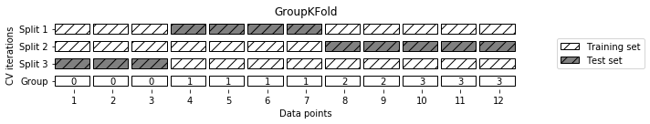
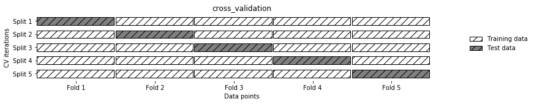
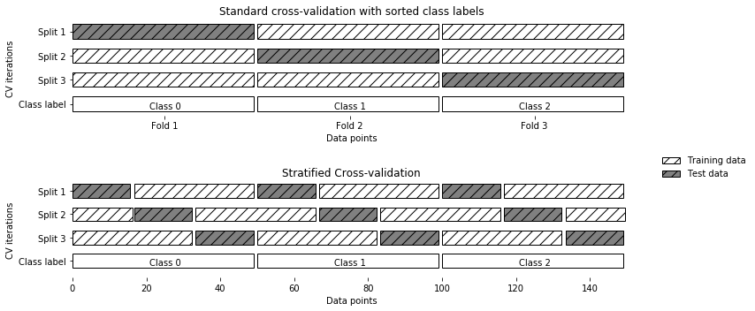

## Category Encoders
[공식 홈페이지](http://contrib.scikit-learn.org/categorical-encoding/)에서 확인이 가능하며, `scikit-learn`에서 지원하는 인코딩 방식은 다음과 같다.
### Scikit-learn currently implemented
- Ordinal
- One-Hot
- Binary
- Helmert Contrast
- Sum Contrast
- Polynomial Contrast
- Backward Difference Contrast
- Hashing
- BaseN
- LeaveOneOut
- Target Encoding

이번 장에서는 `One-Hot-Encoding`과 `Label Encoding`에 대해 살펴보고자 한다.


```python
import numpy as np
import pandas as pd
import seaborn as sns
```


```python
iris = sns.load_dataset('iris')
iris.info()
```

    <class 'pandas.core.frame.DataFrame'>
    RangeIndex: 150 entries, 0 to 149
    Data columns (total 5 columns):
    sepal_length    150 non-null float64
    sepal_width     150 non-null float64
    petal_length    150 non-null float64
    petal_width     150 non-null float64
    species         150 non-null object
    dtypes: float64(4), object(1)
    memory usage: 5.9+ KB


## One-Hot-Encoding
<b>원핫 인코딩(One-Hot-Encoding)</b>이란 단 하나의 값만 `True`이고 나머지는 모두 `False`인 인코딩 방식을 의미한다.
즉, 1개만 `Hot(True)`이고 나머지는 `Cold(False)`로 변환한다. 
예를들어 총 3가지로 분류가 가능한 데이터가 있고, 2번째 데이터에 해당한다면 `[0, 1, 0]`처럼 2번째(인덱스는 0부터 시작하므로 1번째)에 해당하는 데이터를 제외한 나머지가 0이 된다.

<b>판다스(Pandas)</b>에서는 `get_dummies`, <b>케라스(keras)</b> 등에서는 `to_categorical` 함수를 통해 원핫 인코딩을 할 수 있다.


```python
pd.get_dummies(iris.species).sample(5)
```


<div>
<style scoped>
    .dataframe tbody tr th:only-of-type {
        vertical-align: middle;
    }

    .dataframe tbody tr th {
        vertical-align: top;
    }

    .dataframe thead th {
        text-align: right;
    }
</style>
<table border="1" class="dataframe">
  <thead>
    <tr style="text-align: right;">
      <th></th>
      <th>setosa</th>
      <th>versicolor</th>
      <th>virginica</th>
    </tr>
  </thead>
  <tbody>
    <tr>
      <th>53</th>
      <td>0</td>
      <td>1</td>
      <td>0</td>
    </tr>
    <tr>
      <th>49</th>
      <td>1</td>
      <td>0</td>
      <td>0</td>
    </tr>
    <tr>
      <th>124</th>
      <td>0</td>
      <td>0</td>
      <td>1</td>
    </tr>
    <tr>
      <th>86</th>
      <td>0</td>
      <td>1</td>
      <td>0</td>
    </tr>
    <tr>
      <th>6</th>
      <td>1</td>
      <td>0</td>
      <td>0</td>
    </tr>
  </tbody>
</table>
</div>


위의 결과를 확인해보면 정답셋(species)으로 묶여 하나의 열(row)에 존재하던 데이터가 3개로 분리되어 각 데이터에 해당하는 값에 `True`와 `False`로 표현되었다.

다른 방법은 `scikit-learn` 패키지에서 제공하는 `preprocessing` 모듈의 `OneHotEncoder`를 사용할 수 있다.


```python
from sklearn.preprocessing import OneHotEncoder
ohe = OneHotEncoder()
```

먼저 `OneHotEncoder` 객체를 인스턴스화 시킨 후에 `transform` 메소드를 호출하여 변환시킨다.


```python
categories = ohe.fit_transform(iris[['species']]).toarray()
categories[:10]
```


    array([[1., 0., 0.],
           [1., 0., 0.],
           [1., 0., 0.],
           [1., 0., 0.],
           [1., 0., 0.],
           [1., 0., 0.],
           [1., 0., 0.],
           [1., 0., 0.],
           [1., 0., 0.],
           [1., 0., 0.]])


```python
from sklearn.model_selection import train_test_split
X_train, X_test, y_train, y_test =\
    train_test_split(iris.iloc[:, :-1], categories)
```

이제 학습을 시켜본다.


```python
from sklearn.neighbors import KNeighborsClassifier

knn = KNeighborsClassifier()
knn.fit(X_train, y_train)
```


    KNeighborsClassifier(algorithm='auto', leaf_size=30, metric='minkowski',
               metric_params=None, n_jobs=None, n_neighbors=5, p=2,
               weights='uniform')


```python
knn.score(X_test, y_test)
```


    0.9736842105263158


## Label Encoding
<b>라벨 인코딩(Label Encoding)</b>은 문자열이나 정수로된 라벨값을 0부터 n−1까지의 정수로 변환시킨다.


```python
from sklearn.preprocessing import LabelEncoder

le = LabelEncoder()
le.fit_transform(iris.species)
```


    array([0, 0, 0, 0, 0, 0, 0, 0, 0, 0, 0, 0, 0, 0, 0, 0, 0, 0, 0, 0, 0, 0,
           0, 0, 0, 0, 0, 0, 0, 0, 0, 0, 0, 0, 0, 0, 0, 0, 0, 0, 0, 0, 0, 0,
           0, 0, 0, 0, 0, 0, 1, 1, 1, 1, 1, 1, 1, 1, 1, 1, 1, 1, 1, 1, 1, 1,
           1, 1, 1, 1, 1, 1, 1, 1, 1, 1, 1, 1, 1, 1, 1, 1, 1, 1, 1, 1, 1, 1,
           1, 1, 1, 1, 1, 1, 1, 1, 1, 1, 1, 1, 2, 2, 2, 2, 2, 2, 2, 2, 2, 2,
           2, 2, 2, 2, 2, 2, 2, 2, 2, 2, 2, 2, 2, 2, 2, 2, 2, 2, 2, 2, 2, 2,
           2, 2, 2, 2, 2, 2, 2, 2, 2, 2, 2, 2, 2, 2, 2, 2, 2, 2])


디코딩을 할 때는 다음과 같이 `inverse_transform` 메소드를 호출한다.


```python
le.inverse_transform([0, 1, 2])
```


    array(['setosa', 'versicolor', 'virginica'], dtype=object)


# 검증 (Validation)

## KFold
- 데이터의 수가 적은 경우에는 이 데이터 중의 일부인 검증 데이터의 수도 적기 때문에 검증 성능의 신뢰도가 떨어진다.
- 그렇다고 검증 데이터의 수를 증가시키면 학습용 데이터의 수가 적어지므로 정상적인 학습이 되지 않는다.
- 이러한 딜레마를 해결하기 위한 검증 방법이 K-폴드(K-fold) 교차검증 방법이다.

교육상의 목적으로 `mglearn` 패키지를 받는다.
```
%pip install --upgrade mglearn
```


```python
import mglearn
mglearn.plots.plot_group_kfold()
```





KFold로 validation을 해본다.


```python
from sklearn.model_selection import KFold
kf = KFold(10)
X = kf.split(iris.iloc[:, :-1], le.fit_transform(iris.species))
X
```


    <generator object _BaseKFold.split at 0x7f6a8b3a7780>


학습된 모델들에 대한 정답률의 평균을 구해본다.


```python
mean = []
for i, j in X:
    mean.append(KNeighborsClassifier()
                .fit(iris.iloc[i, :-1],
                     iris.iloc[i, -1])
                .score(iris.iloc[j, :-1],
                       iris.iloc[j, -1]))
np.mean(mean)
```


    0.9333333333333333


## Cross Validation

데이터셋의 크기가 작은 경우 테스트셋에 대한 성능 평가의 신뢰성이 떨어지게 되는데, <b>교차 검증(Cross Validation)</b>은 모든 데이터가 최소 한번 이상 테스트셋으로 쓰이도록 한다.


```python
mglearn.plots.plot_cross_validation()
```





## Stratified Cross-validation


```python
mglearn.plot_cross_validation.plot_stratified_cross_validation()
```





```python
from sklearn.model_selection import cross_val_score

knn = KNeighborsClassifier()
cvs = cross_val_score(knn, iris.iloc[:, :-1], iris.iloc[:, -1], cv=5)
cvs.mean()
```


    0.9733333333333334


`classification_report`를 통해 성능을 확인할 수 있다.


```python
from sklearn.metrics import classification_report

knn = KNeighborsClassifier()
knn.fit(X_train, y_train)
print(classification_report(y_test, knn.predict(X_test)))
```

                  precision    recall  f1-score   support
    
               0       1.00      1.00      1.00        16
               1       0.91      1.00      0.95        10
               2       1.00      0.92      0.96        12
    
       micro avg       0.97      0.97      0.97        38
       macro avg       0.97      0.97      0.97        38
    weighted avg       0.98      0.97      0.97        38
     samples avg       0.97      0.97      0.97        38
    

---

## IPA 주관 인공지능센터 기본(fundamental) 과정
- GitHub link: here
- E-Mail: windkyle7@gmail.com